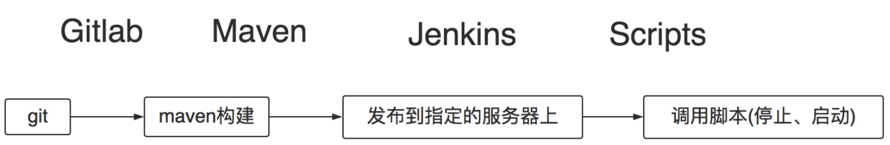
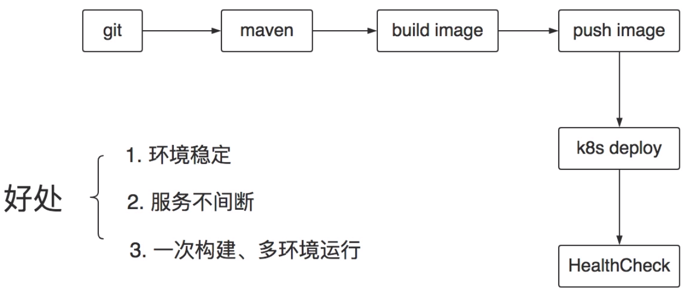
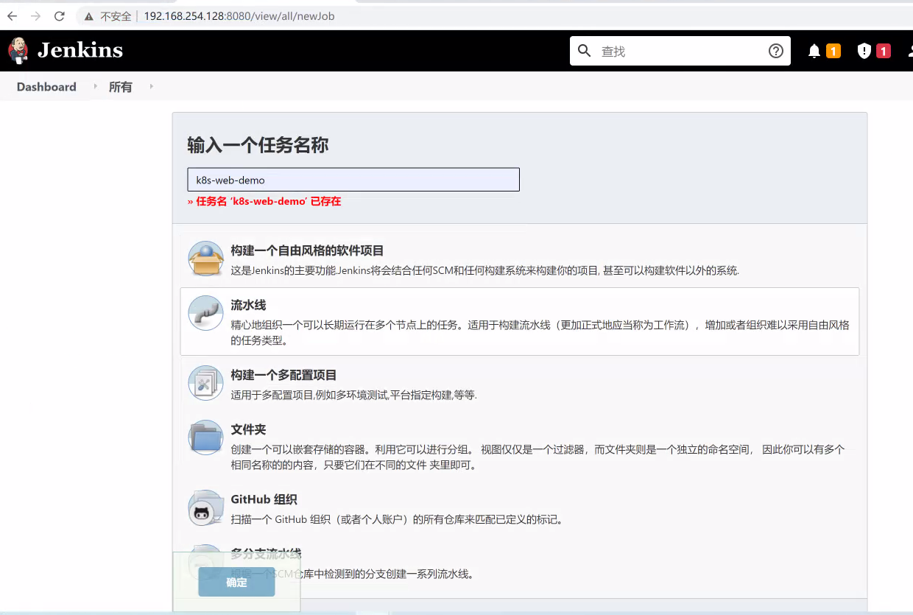
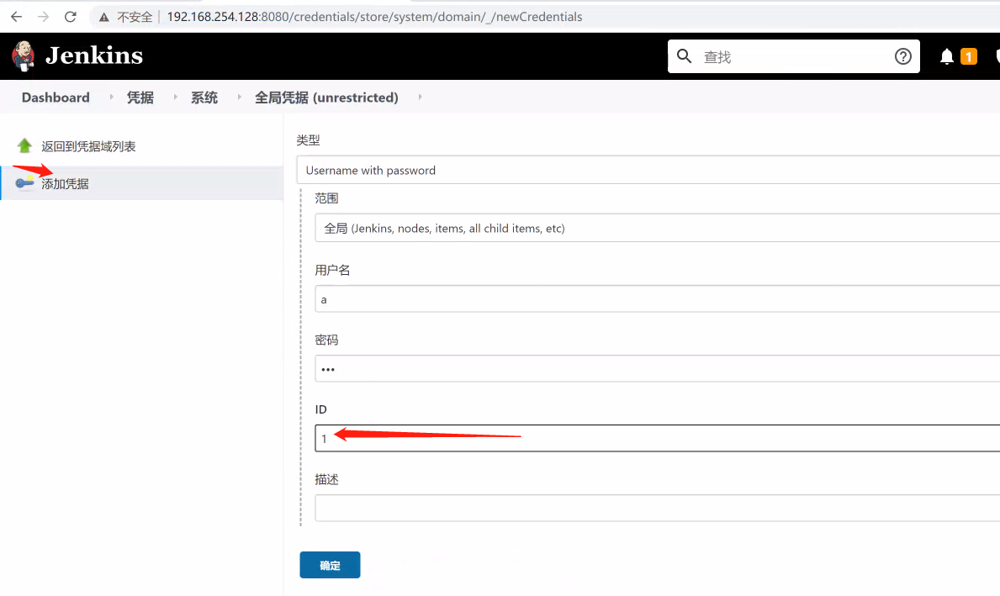
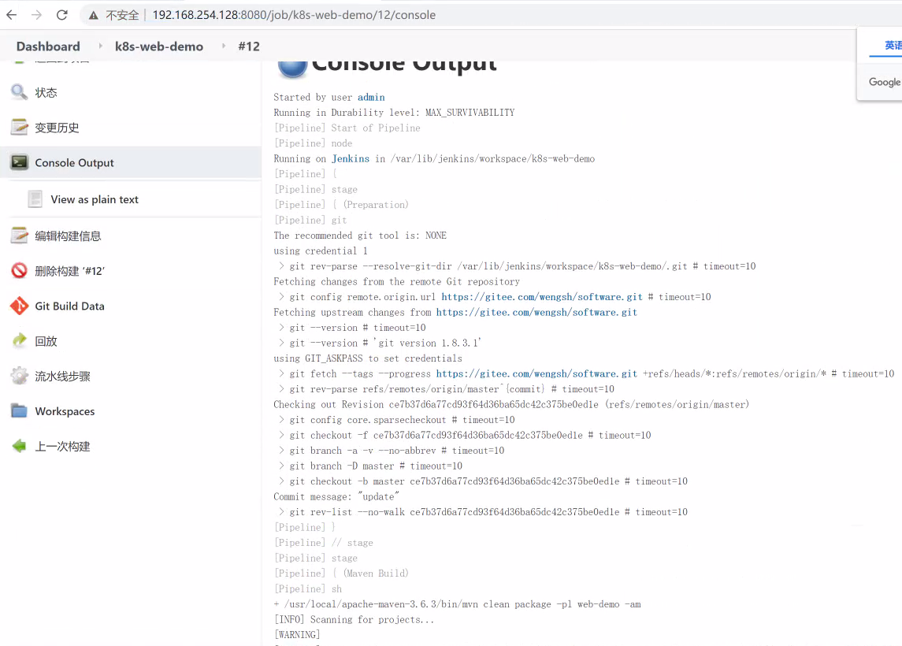
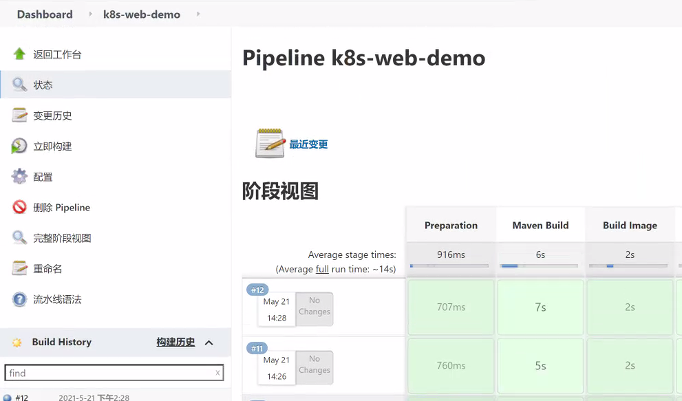
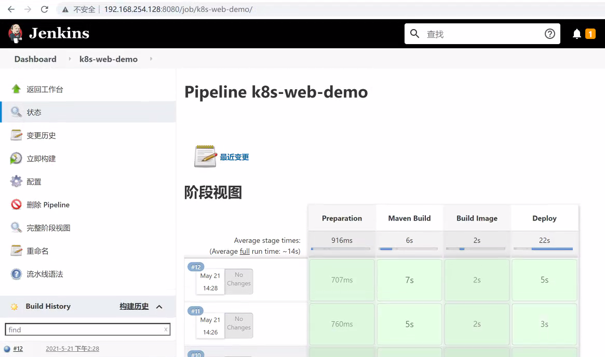
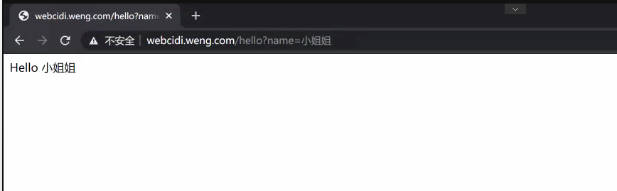
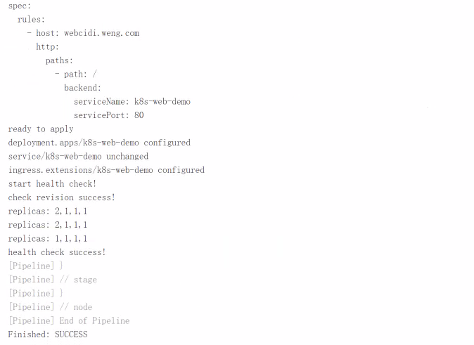

[TOC]


# K8s - CICD实践

----------


## k8s与cicd

没有k8s的时候，ci/cd的流程：



问题：
1. 服务间断，需要停止原来的服务
2. 环境不可控，有人修改了系统的一些文件或环境变量可能导致服务异常
3. 构建或发布不成功需要人工介入处理
4. 多个环境需要多次构建（dev、test、pre、prod）

有了k8s之后，ci/cd的流程：



----------


## 搭建Jenkins 参考https://www.cnblogs.com/wengshaohang/p/12272952.html

官方文档：
- https://www.jenkins.io/doc/

**前置说明：**在部署Jenkins的机器上需要事先安装好JDK、maven以及git，因为我们是Java项目这是必须的工具。还需要注意的是，这些工具（git除外）的环境变量需配置在`/etc/bashrc`文件中，因为Jenkins是非登录式执行命令的，所以`/etc/profile`不会被加载

----------

## maven构建项目

本文使用的示例代码仓库地址如下：
- https://gitee.com/wengsh/software.git

完成Jenkins的搭建后，我们开始实践ci/cd，第一阶段是从远程git仓库拉取代码并通过maven构建项目。首先在首页点击创建一个新任务，输入任务名称并选择“流水线”类型：



添加凭据，拉取代码使用：



编写Pipeline script，该脚本定义了流水线的每个步骤该做的事：内容如下：

```
node {

      // 定义构建目录
    env.BUILD_DIR = "/home/jenkins/build-workspace"
        // 定义目标项目的名称
    env.MODULE = 'web-demo'
    env.HOST = 'webcidi.weng.com'
    
    stage('Preparation') { // for display purposes
        // Get some code from a GitHub repository
        git credentialsId: '1', url: 'https://gitee.com/wengsh/software.git'
    }
}

```

Jenkins默认通过`ssh`的方式从远端拉取代码，所以需要为Jenkins用户生成密钥对，并将公钥配置到远程的git仓库上。但由于操作系统中的jenkins用户默认是不能登录的，需要修改jenkins的登录权限，修改后如下：
```bash
[root@s2 ~]# vim /etc/passwd
jenkins:x:997:993:Jenkins Automation Server:/var/lib/jenkins:/bin/bash
```

重启Jenkins：
```bash
$ systemctl restart jenkins
```

到任务页面，点击“Build Now”，有些版本为“立即构建”：



构建成功，可以在阶段视图查看各个阶段的构建日志：

----------


## 构建docker镜像

第一阶段完成了代码的拉取及项目的编译构建，并且也测试通过了。接着第二个阶段就是构建docker镜像，并将镜像推送到远程的Harbor仓库上。修改pipeline script的内容如下：
```
node {
     // 定义构建目录
    env.BUILD_DIR = "/home/jenkins/build-workspace"
        // 定义目标项目的名称
    env.MODULE = 'web-demo'
    env.HOST = 'webcidi.weng.com'
    
    stage('Preparation') { // for display purposes
        git credentialsId: '1', url: 'https://gitee.com/wengsh/software.git'
    }

    stage('Maven Build') { // for display purposes
        sh "/usr/local/apache-maven-3.6.3/bin/mvn clean package -pl ${MODULE} -am"
    }
    
    stage('Build Image') { // for display purposes
        sh "/home/build-web-image.sh"
    }
   
    
}

```

由于构建docker镜像的步骤也不少，直接写在pipeline script中不太好管理，所以这里单独定义一个shell脚本完成这件事。创建镜像构建脚本：
```bash
[root@master home]# mkdir /home/jenkins/
[root@master home]# vim /home/jenkins/build-web-image.sh
#!/bin/bash

# 判断pipeline脚本中定义的构建目录是否存在
if [ "${BUILD_DIR}" == "" ];then
    echo "env 'BUILD_DIR' is not set"
    exit 1
fi

# 定义构建docker镜像时的工作目录
DOCKER_DIR=${BUILD_DIR}/${JOB_NAME}
if [ ! -d ${DOCKER_DIR} ];then
    mkdir -p ${DOCKER_DIR}
fi

echo "docker workspace: ${DOCKER_DIR}"

# 项目所在的Jenkins工作目录路径
JENKINS_DIR=${WORKSPACE}/${MODULE}
echo "jenkins workspace: ${JENKINS_DIR}"

if [ ! -f ${JENKINS_DIR}/target/*.war ];then
    echo "target war file not found ${JENKINS_DIR}/target/*.war"
    exit 1
fi

cd ${DOCKER_DIR}
rm -rf *
unzip -oq ${JENKINS_DIR}/target/*.war -d ./ROOT

cp ${JENKINS_DIR}/Dockerfile .
if [ -d ${JENKINS_DIR}/dockerfiles ];then
    cp -r ${JENKINS_DIR}/dockerfiles .
fi

# 生成版本号
VERSION=$(date +%Y%m%d%H%M%S)
IMAGE_NAME=192.168.254.131/k8s/${JOB_NAME}:${VERSION}
# 将镜像名称写到一个文件中，方便后续脚本获取
echo "${IMAGE_NAME}" > ${WORKSPACE}/IMAGE
echo "building image: ${IMAGE_NAME}"

# 构建镜像并推送到远端仓库
docker build -t ${IMAGE_NAME} .
docker push ${IMAGE_NAME}
```

修改目录的所属用户为jenkins，并给脚本加上可执行权限：
```bash
# chown -R jenkins:jenkins /home/jenkins/
# chmod a+x /home/jenkins/build-web-image.sh
```

由于构建镜像的过程中jenkins需要访问docker，得将jenkins用户添加到docker用户组下，否则会报权限异常：
```bash
# usermod -a -G docker jenkins
# chmod 666 /var/run/docker.sock
```

如果不想被各种权限搞得那么麻烦，并且条件允许的话，可以将jenkins服务使用的用户设置为`root`，这样就不需要老是关注权限的问题了：
```bash
# vim /etc/sysconfig/jenkins
JENKINS_USER="jenkins"
```

然后还需要切换到jenkins用户下，执行`docker login`登录一下远程的registry，否则`push`镜像会失败：
```bash
# su jenkins
$ docker login 192.168.254.131
```

回到Jenkins任务界面上尝试构建一下看看能否成功，可以看到我这里三个阶段都success了：



----------


## 部署到k8s

现在我们完成了拉取代码到build docker 镜像的过程，有了镜像后接下来就可以将项目部署到k8s集群中了。这也就是第三个阶段：部署（deploy）。

我们知道将项目部署到k8s中需要先定义k8s的资源配置文件，但配置文件中会有一些容易发生改变的内容，我们需要将其抽取成变量，而不是写死在配置文件中。所以我们先定义一个配置文件的模板：
```bash
# mkdir /home/jenkins/template
# vim /home/jenkins/template/web.yaml
```

`web.yaml`文件的内容如下：
```yaml
#deploy
apiVersion: apps/v1
kind: Deployment
metadata:
  name: {{name}}
spec:
  selector:
    matchLabels:
      app: {{name}}
  replicas: 1
  template:
    metadata:
      labels:
        app: {{name}}
    spec:
      containers:
      - name: {{name}}
        image: {{image}} 
        ports:
        - containerPort: 8080
---
#service
apiVersion: v1
kind: Service
metadata:
  name: {{name}}
spec:
  ports:
  - port: 80
    protocol: TCP
    targetPort: 8080
  selector:
    app: {{name}}
  type: ClusterIP

---
#ingress
apiVersion: extensions/v1beta1
kind: Ingress
metadata:
  name: {{name}}
spec:
  rules:
    - host: {{host}} 
      http:
        paths:
          - path: /
            backend:
              serviceName: {{name}}
              servicePort: 80
```

然后修改pipeline script内容如下：
```
node {
     // 定义构建目录
    env.BUILD_DIR = "/home/jenkins/build-workspace"
     // 定义目标项目的名称
    env.MODULE = 'web-demo'
    env.HOST = 'webcidi.weng.com'
    
    stage('Preparation') { // for display purposes
        git credentialsId: '1', url: 'https://gitee.com/wengsh/software.git'
    }

    stage('Maven Build') { // for display purposes
        sh "/usr/local/apache-maven-3.6.3/bin/mvn clean package -pl ${MODULE} -am"
    }
    
    stage('Build Image') { // for display purposes
        sh "/home/build-web-image.sh"
    }
    
    stage('Deploy') { // for display purposes
        sh "/home/deploy.sh"
    }
    
}

```

接着编写`deploy.sh`部署脚本：
```bash
# vim /home/jenkins/deploy.sh
#!/bin/bash

name=${JOB_NAME}
image=$(cat ${WORKSPACE}/IMAGE)
host=${HOST}

echo "deploying ... name: ${name}, image: ${image}, host: ${host}"

rm -f web.yaml
cp $(dirname "${BASH_SOURCE[0]}")/template/web.yaml .
echo "copy ok"
# 模板文件中的替换占位符
sed -i "s,{{name}},${name},g" web.yaml
sed -i "s,{{image}},${image},g" web.yaml
sed -i "s,{{host}},${host},g" web.yaml

cat web.yaml
echo "ready to apply"
kubectl apply -f web.yaml
echo "apply ok"
```

给脚本赋予可执行权限：
```bash
# chmod a+x /home/jenkins/script/deploy.sh
```

将`kubectl`的配置文件拷贝到Jenkins的工作目录下（该目录为Jenkins的默认家目录）：
```bash
# cp /root/.kube/config /var/lib/jenkins/.kube/config
# chown jenkins:jenkins /var/lib/jenkins/.kube/config
```

切换到jenkins用户，测试能否通过`kubectl`访问到k8s集群：
```bash
[root@master home]# su jenkins
bash-4.2$ kubectl get nodes
NAME     STATUS   ROLES    AGE    VERSION
master   Ready    master   4d2h   v1.18.0
node1    Ready    <none>   4d2h   v1.18.0
node2    Ready    <none>   4d2h   v1.18.0
bash-4.2$ 
```

没问题后，回到Jenkins上执行构建。我这里是都执行成功了：



查看项目在k8s集群中的运行状态是否正常：
```bash
[root@master home]# kubectl get pods,deploy
NAME                                READY   STATUS    RESTARTS   AGE
pod/dubbo-demo-644c64568d-5v6wh     1/1     Running   0          29m
pod/k8s-web-demo-58c9b54c7b-zvb8t   1/1     Running   0          29m

NAME                           READY   UP-TO-DATE   AVAILABLE   AGE
deployment.apps/dubbo-demo     1/1     1            1           29m
deployment.apps/k8s-web-demo   1/1     1            1           19h
[root@master home]# 
```

----------

可以正常访问




## 健康检查

到此，我们把第三阶段的部署也完成了，项目也成功的跑起来了，看似好像已经到了终点，但实则不然。因为我们还不能确定项目能够正常对外提供服务，还需要自己到系统上通过命令行查看，所以我们还有一步健康检查需要做。修改之前的`deploy.sh`脚本，代码如下：
```bash
#!/bin/bash

name=${JOB_NAME}
image=$(cat ${WORKSPACE}/IMAGE)
host=${HOST}

echo "deploying ... name: ${name}, image: ${image}, host: ${host}"

rm -f web.yaml
cp $(dirname "${BASH_SOURCE[0]}")/template/web.yaml .
echo "copy ok"
# 模板文件中的替换占位符
sed -i "s,{{name}},${name},g" web.yaml
sed -i "s,{{image}},${image},g" web.yaml
sed -i "s,{{host}},${host},g" web.yaml

cat web.yaml
echo "ready to apply"
# 获取当前的deploy次数
revision=$(kubectl get deploy ${name} -o go-template='{{index .metadata.annotations "deployment.kubernetes.io/revision"}}')
kubectl apply -f web.yaml


# ===== 健康检查 =====
echo "start health check!"

new_revision=$(kubectl get deploy ${name} -o go-template='{{index .metadata.annotations "deployment.kubernetes.io/revision"}}')
check_count=0
# 如果等于apply之前的次数，代表还没deploy完成
while [ "${new_revision}" == "${revision}" ]
do
    if [ ${check_count} -gt 60 ];then
        echo "deploy failed!"
        exit 1
    fi

    sleep 1
    new_revision=$(kubectl get deploy ${name} -o go-template='{{index .metadata.annotations "deployment.kubernetes.io/revision"}}')
    ((check_count++))
    echo "check revision ${check_count} times"
done
echo "check revision success!"

success=0
count=60
# 转换数组时的分隔符
IFS=","
while [ ${count} -gt 0 ]
do
    # 获取各种副本数
    replicas=$(kubectl get deploy ${name} -o go-template='{{.status.replicas}},{{.status.updatedReplicas}},{{.status.readyReplicas}},{{.status.availableReplicas}}')
    echo "replicas: ${replicas}"
    # 转换为数组
    arr=(${replicas})
    # 判断各种副本数是否相等
    if [ "${arr[0]}" == "${arr[1]}" -a "${arr[1]}" == "${arr[2]}" -a "${arr[2]}" == "${arr[3]}" ];then
        echo "health check success!"
        success=1
        break
    fi

    ((count--))
    sleep 2
done

if [ ${success} -ne 1 ];then
    echo "health check failed!"
    exit 1
fi

```

然后回到Jenkins上测试下能否正常构建：


查看日志输出，确认有进行健康检查：



到此我们整个ci/cd流程就演示完了，接下来你可以尝试去将其他项目ci/cd化。