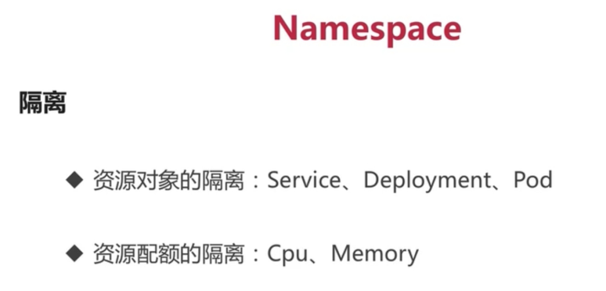
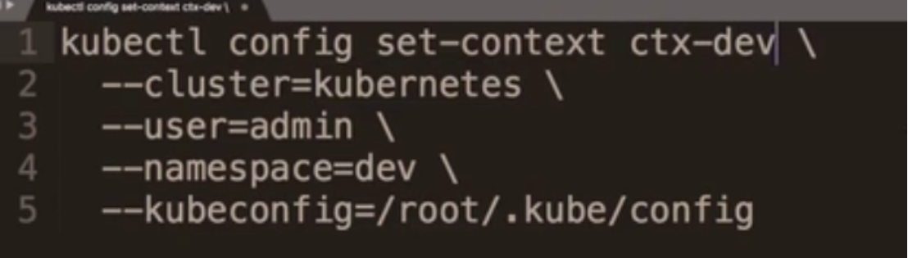
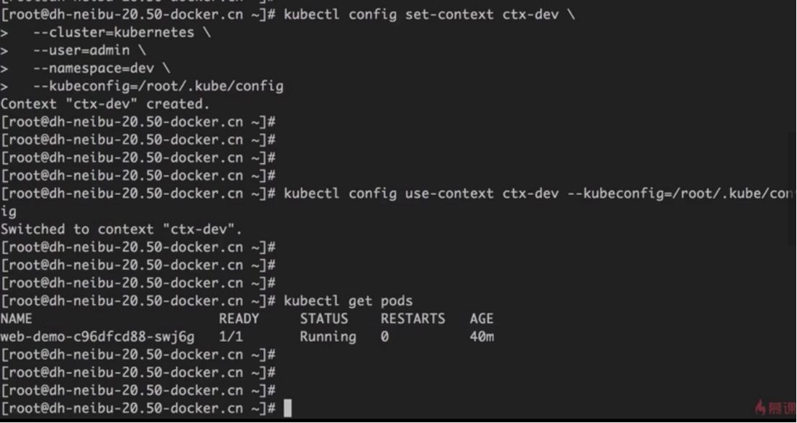

同一个namespace下，pod之间可以通过名字直接访问。

[root@master ~]# kubectl get pods -n default

```
NAME                  READY  STATUS   RESTARTS  AGE
dubbo-demo-644c64568d-5v6wh      1/1   Running  2      44h
k8s-web-demo-58c9b54c7b-zvb8t     1/1   Running  2      44h
springboot-web-demo-66f89d498-q5glg  1/1   Running  0      3s
web-demo-77b66c9d7d-r6ldl       1/1   Running  0      60s
```

[root@master ~]# kubectl exec -it web-demo-77b66c9d7d-r6ldl bash

```
bash-4.4# ping springboot-web-demo
PING springboot-web-demo (10.103.211.39): 56 data bytes
^C
--- springboot-web-demo ping statistics ---
3 packets transmitted, 0 packets received, 100% packet loss
bash-4.4# ping springboot-web-demo
PING springboot-web-demo (10.103.211.39): 56 data bytes
^C
--- springboot-web-demo ping statistics ---
6 packets transmitted, 0 packets received, 100% packet loss
bash-4.4# wget springboot-web-demo/hello?name=aaa
Connecting to springboot-web-demo (10.103.211.39:80)
hello?name=aaa    100% |******************************************************************************************************************|   46  0:00:00 ETA
bash-4.4# ls
LICENSE     RELEASE-NOTES  bin       hello?name=aaa  lib       native-jni-lib  webapps
NOTICE      RUNNING.txt   conf       include     logs       temp       work
bash-4.4# cat hello\?name\=aaa 
Hello aaa! I'm springboot-web-demo controller!bash-4.4# 
bash-4.4#
```

不同namespace的pod不能通过名字访问，但是service ip和pod ip可以互相访问，namespace的隔离是对名字的隔离

```
[root@master ~]# kubectl exec -it web-demo-77b66c9d7d-dg8xf bash -n dev
kubectl exec [POD] [COMMAND] is DEPRECATED and will be removed in a future version. Use kubectl kubectl exec [POD] -- [COMMAND] instead.
bash-4.4# ping springboot-web-demo
ping: bad address 'springboot-web-demo'
bash-4.4# cat /etc/resolv.conf 
nameserver 10.96.0.10
search dev.svc.cluster.local svc.cluster.local cluster.local
options ndots:5
bash-4.4# 
```

[root@master ~]# kubectl get svc

```
NAME          TYPE     CLUSTER-IP    EXTERNAL-IP  PORT(S)  AGE
k8s-web-demo      ClusterIP  10.108.35.30   <none>     80/TCP   2d16h
kubernetes       ClusterIP  10.96.0.1     <none>     443/TCP  5d22h
springboot-web-demo  ClusterIP  10.103.211.39   <none>     80/TCP   12m
web-demo        ClusterIP  10.110.108.241  <none>     80/TCP   13m
```

[root@master ~]# kubectl exec -it web-demo-77b66c9d7d-dg8xf bash -n dev

```
kubectl exec [POD] [COMMAND] is DEPRECATED and will be removed in a future version. Use kubectl kubectl exec [POD] -- [COMMAND] instead.
bash-4.4# wget 10.103.211.39
Connecting to 10.103.211.39 (10.103.211.39:80)
wget: server returned error: HTTP/1.1 404 
bash-4.4# wget 10.103.211.39/hello?name=ff
Connecting to 10.103.211.39 (10.103.211.39:80)
hello?name=ff     100% |******************************************************************************************************************|   45  0:00:00 ETA
bash-4.4#
```

[root@master ~]# kubectl get pods -o wide

```
NAME                  READY  STATUS   RESTARTS  AGE  IP         NODE   NOMINATED NODE  READINESS GATES
dubbo-demo-644c64568d-5v6wh      1/1   Running  2      44h  192.168.254.130  node2  <none>      <none>
k8s-web-demo-58c9b54c7b-zvb8t     1/1   Running  2      44h  10.244.2.31    node2  <none>      <none>
springboot-web-demo-66f89d498-q5glg  1/1   Running  0      16m  10.244.2.32    node2  <none>      <none>
web-demo-77b66c9d7d-r6ldl       1/1   Running  0      16m  10.244.1.53    node1  <none>      <none>
```

[root@master ~]# kubectl exec -it web-demo-77b66c9d7d-dg8xf bash -n dev

```
kubectl exec [POD] [COMMAND] is DEPRECATED and will be removed in a future version. Use kubectl kubectl exec [POD] -- [COMMAND] instead.
bash-4.4# wget 10.244.2.32:8080/hello?name=xxx
Connecting to 10.244.2.32:8080 (10.244.2.32:8080)
hello?name=xxx    100% |******************************************************************************************************************|   46  0:00:00 ETA
bash-4.4# 
```

设置Kubectl get pod显示的是dev 的namespace, 在不指定-n 参数的情况下

 

Cp /root/.kube/config /root/.kube/config.bak

 

 

 

