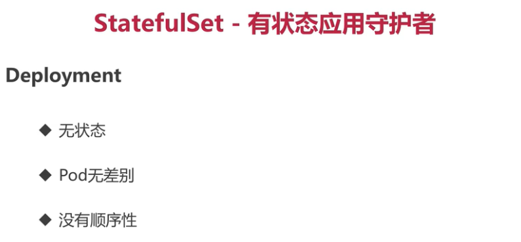

#### 顺序性

```
[root@master ~]# kubectl apply -f headless-service.yaml 
service/springboot-web-svc created
[root@master ~]# kubectl apply -f statefulset.yaml 
statefulset.apps/springboot-web created
[root@master ~]#  kubectl get pods -l app=springboot-web -o wide
NAME               READY   STATUS    RESTARTS   AGE     IP             NODE    NOMINATED NODE   READINESS GATES
springboot-web-0   1/1     Running   0          2m17s   10.244.1.123   node1   <none>           <none>
springboot-web-1   1/1     Running   0          116s    10.244.2.112   node2   <none>           <none>
[root@master ~]#
```

进入node1,node2容器查看hostname

```
[root@node1 ~]# docker exec -it 21e6323a3229 sh
/ # hostname
springboot-web-0
[root@node2 ~]# docker exec -it 49d41eef6481 sh
/ # hostname
springboot-web-1
/ # 
```

测试能否ping 通 ，podname.servicename.namespace，可以通过名字互相访问

```
[root@node1 ~]# docker exec -it 21e6323a3229 sh
/ # ping springboot-web-0.springboot-web-svc.default
PING springboot-web-0.springboot-web-svc.default (10.244.1.123): 56 data bytes
64 bytes from 10.244.1.123: seq=0 ttl=64 time=0.452 ms
64 bytes from 10.244.1.123: seq=1 ttl=64 time=0.075 ms
64 bytes from 10.244.1.123: seq=2 ttl=64 time=0.083 ms
64 bytes from 10.244.1.123: seq=3 ttl=64 time=0.113 ms
64 bytes from 10.244.1.123: seq=4 ttl=64 time=0.101 ms
64 bytes from 10.244.1.123: seq=5 ttl=64 time=0.089 ms
^C
--- springboot-web-0.springboot-web-svc.default ping statistics ---
6 packets transmitted, 6 packets received, 0% packet loss
round-trip min/avg/max = 0.075/0.152/0.452 ms
/ # ping springboot-web-1.springboot-web-svc.default
PING springboot-web-1.springboot-web-svc.default (10.244.2.112): 56 data bytes
64 bytes from 10.244.2.112: seq=0 ttl=62 time=6.184 ms
64 bytes from 10.244.2.112: seq=1 ttl=62 time=0.862 ms
64 bytes from 10.244.2.112: seq=2 ttl=62 time=0.817 ms
64 bytes from 10.244.2.112: seq=3 ttl=62 time=0.919 ms
^C
--- springboot-web-1.springboot-web-svc.default ping statistics ---
4 packets transmitted, 4 packets received, 0% packet loss
round-trip min/avg/max = 0.817/2.195/6.184 ms
/ # 
```

把pod删除重启，通过名字还是可以访问

#### 持久存储分区

```
[root@master ~]# kubectl get pod -o wide -l app=springboot-web
NAME               READY   STATUS    RESTARTS   AGE   IP             NODE     NOMINATED NODE   READINESS GATES
springboot-web-0   1/1     Running   0          11m   10.244.1.132   node1    <none>           <none>
springboot-web-1   1/1     Running   0          48s   10.244.2.113   node2    <none>           <none>
[root@master ~]# kubectl get pv,pvc
NAME                                                        CAPACITY   ACCESS MODES   RECLAIM POLICY   STATUS   CLAIM                           STORAGECLASS              REASON   AGE
persistentvolume/pvc-4cfca3b8-6437-4900-9783-5a66d404bc9d   1Gi        RWO            Delete           Bound    default/data-springboot-web-0   glusterfs-storage-class            4m59s
persistentvolume/pvc-b7c4e75d-e16b-49e0-9b1a-46a15221b691   1Gi        RWO            Delete           Bound    default/data-springboot-web-1   glusterfs-storage-class            4m16s
NAME                                          STATUS   VOLUME                                     CAPACITY   ACCESS MODES   STORAGECLASS              AGE
persistentvolumeclaim/data-springboot-web-0   Bound    pvc-4cfca3b8-6437-4900-9783-5a66d404bc9d   1Gi        RWO            glusterfs-storage-class   15m
persistentvolumeclaim/data-springboot-web-1   Bound    pvc-b7c4e75d-e16b-49e0-9b1a-46a15221b691   1Gi        RWO            glusterfs-storage-class   4m24s
[root@master ~]#
```

进入容器查看

```
[root@node1 ~]# docker exec -it e4a5f70454d4 sh
/ # cd /weng-data/
/weng-data # ls
/weng-data # echo "hi" >> /weng-data/file
/weng-data # cat -n /weng-data/file 
     1	hi
/weng-data #
[root@node2 ~]# docker exec -it 5772e13f0e32 sh
/ # echo "hello" >> /weng-data/file
/ # echo -n /weng-data/
/weng-data// # 
/ # cat -n /weng-data/file 
     1	hello
/ # 
```

删除容器再查看还是存在

```
[root@node1 ~]# docker exec -it 3aa71d0e9d34  sh
/ # cat -n /weng-data/file 
     1	hi
/ #ssssssss
```

