Requests

表示容器希望被分配到的可以完全保证的资源量，用于调度策略的计算

Limits

容器能够使用资源的上限

查看节点上的资源情况

[root@master ~]# kubectl get nodes

```
NAME   STATUS  ROLES   AGE   VERSION
master  Ready   master  5d23h  v1.18.0
node1   Ready   <none>  5d23h  v1.18.0
node2   Ready   <none>  5d23h  v1.18.0
```

[root@master ~]# kubectl describe node node1

修改requests和limits的内存和cpu,重新apply -f，会重新启动pod，因为修改资源大小依赖的是docker的隔离机制，需要重新启动docker才可以把这些隔离机制的参数加进去


Docker inspect 容器id 查看

CpuShares 的值 等于  Requests.cpu的值 转换为0.1核心 再乘以 1024 == 102

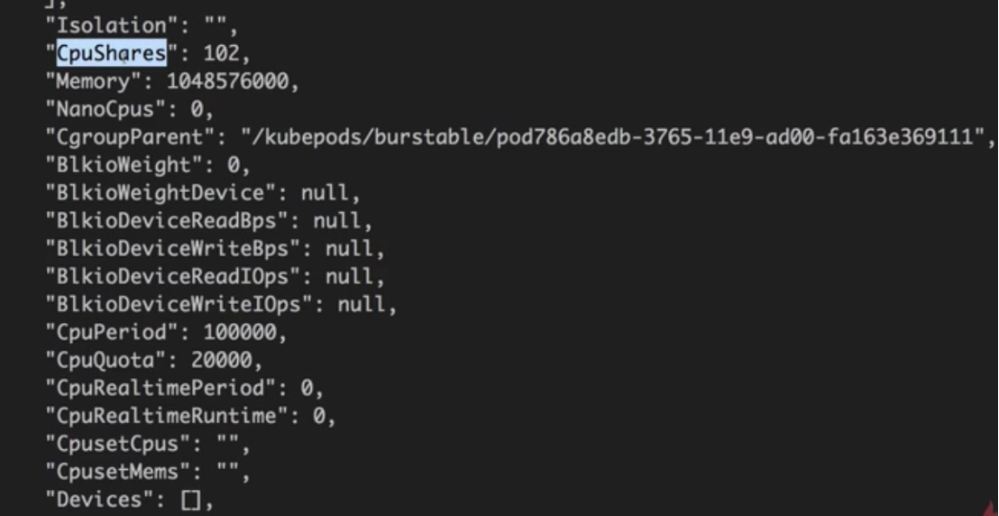 

作用：在Docker发生资源竞争的时候分配给容器资源的比例，

2个容器，requests.cpu分别是1和2 ，cpuShares的值分别是1024和2048，当节点发生资源竞争的时候，docker会尝试按1：2的比例将cpu分配给这2个容器。

Memory的值 ：Docker在运行的时候指定的内存就是limits.memory的内存

CpuQuota 的值 ： limits.cpu 0.2核心 乘以 100000

CpuPeriod : docker默认值 ，单位纳秒，即100毫秒

表示100毫秒内最多分配给这个容器的cpu的量是CpuQuota 的值

 

进入容器模拟消耗内存的操作，

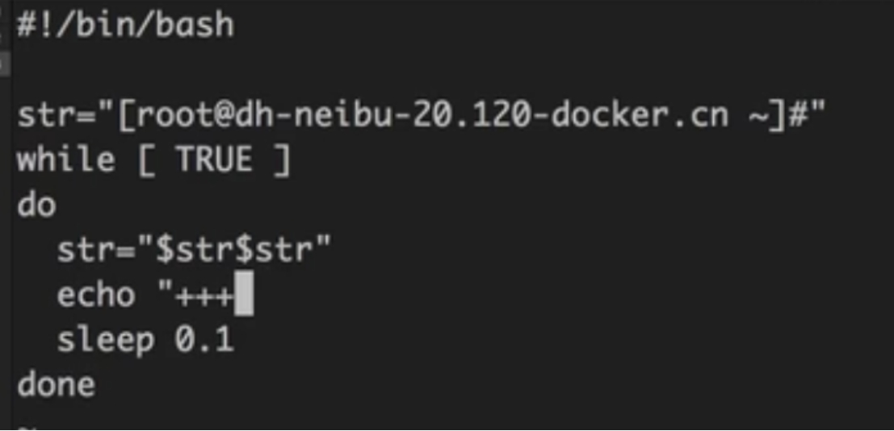 

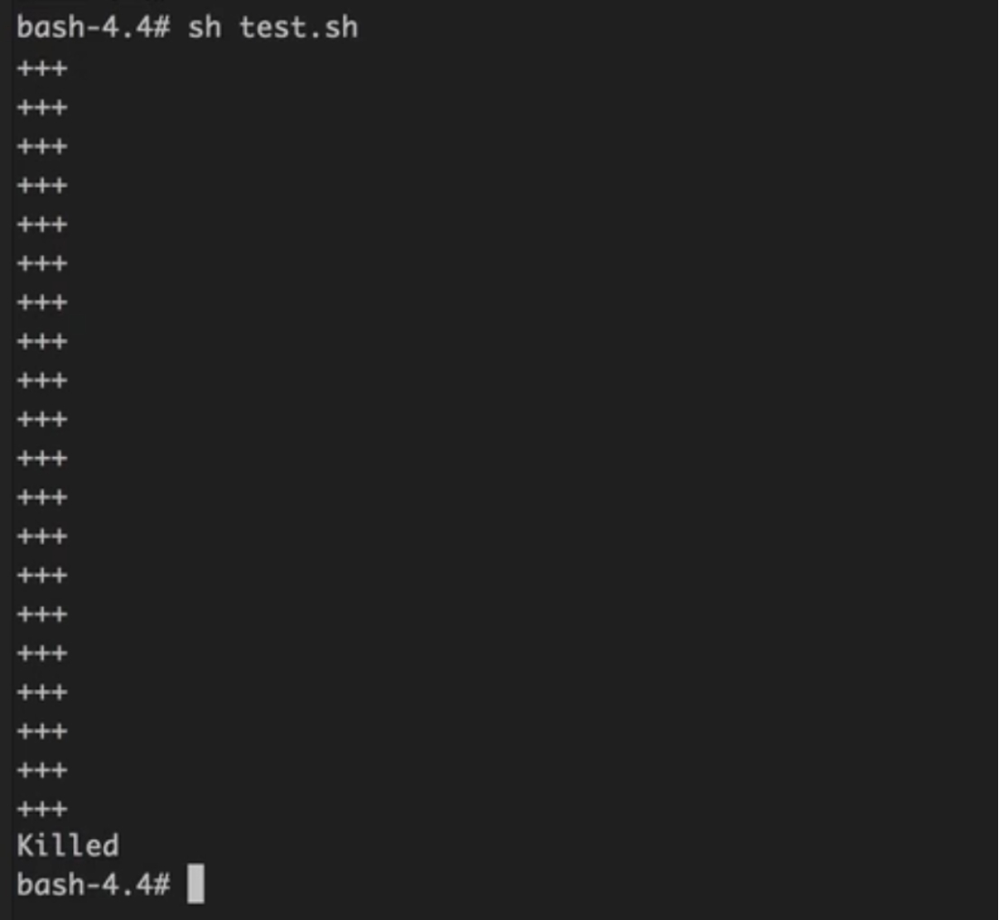 

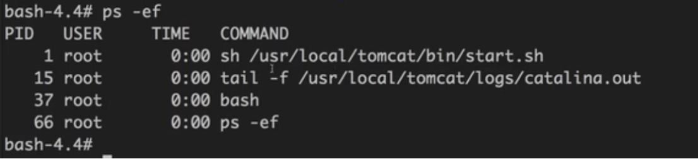 

Kubernetes会把容器里边占用内存最大的进程杀掉，容器不会重启


修改yaml文件，所有节点都没有limits指定值的资源

```
resources:
  requests:
#不加单位默认是字节数
    memory: 100Mi
#不加m，表示100核心的cpu，100个cpu,1核心cpu == 1000m
    cpu: 100m
  limits:
    memory: 100Gi
    cpu: 20000m
```

Kubectl apply -f 可以被正常调度


Requests的内存设置为20G

```
resources:
  requests:
#不加单位默认是字节数
    memory: 20000Mi
  #不加m，表示100核心的cpu，100个cpu,1核心cpu == 1000m
    cpu: 100m
  limits:
    memory: 100Gi
    cpu: 20000m
```

没有满足requests.memory资源的节点，会一直pending

[root@master ~]# kubectl get pod -n dev

```
NAME             READY  STATUS   RESTARTS  AGE
web-demo-666fdbbbf8-rzd55  0/1   Pending  0      12s
web-demo-7cdcc97dd4-vtk5q  1/1   Running  1      3h34m
[root@master ~]# 
```


Requests.cpu设置为10核心

```
resources:
  requests:
#不加单位默认是字节数
    memory: 100Mi
#不加m，表示100核心的cpu，100个cpu,1核心cpu == 1000m
    cpu: 10000m
  limits:
    memory: 100Mi
    cpu: 20000m
```

也是处于pending状态，

[root@master ~]# kubectl describe pod web-demo-666fdbbbf8-rzd55  -n dev

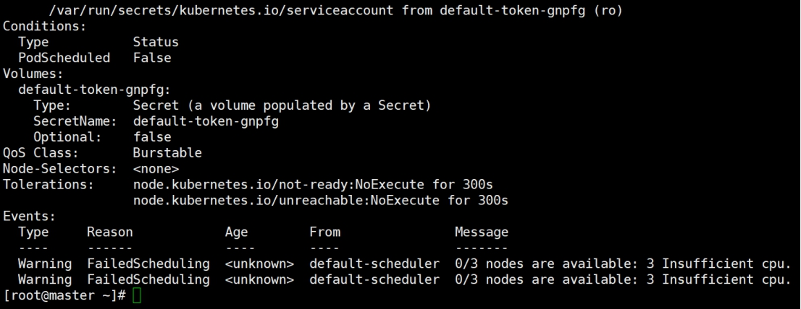 

 

把副本数调为三个，request.memory设置为1000Mi，节点上只有1.5G内存

```
resources:
  requests:
#不加单位默认是字节数
    memory: 1000Mi
#不加m，表示100核心的cpu，100个cpu,1核心cpu == 1000m
    cpu: 100m
  limits:
    memory: 10000Mi
    cpu: 20000m
```

[root@master ~]# kubectl get pod -n dev

```
NAME             READY  STATUS   RESTARTS  AGE
web-demo-5994fd8b9f-4c8rr  0/1   Pending  0      48s
web-demo-5994fd8b9f-qbs88  1/1   Running  0      48s
web-demo-5994fd8b9f-qs84p  1/1   Running  0      48s
```

2个节点各运行了一个，有一个处于pending，说明了request定义的资源是需要预留出来的，不能被其他人占用


Limits.cpu设置为4核心，副本数改为1

```
resources:
  requests:
#不加单位默认是字节数
    memory: 300Mi
#不加m，表示100核心的cpu，100个cpu,1核心cpu == 1000m
    cpu: 100m
  limits:
    memory: 10000Mi
    cpu: 4000m
```

Docker stats aa56  查看资源占用

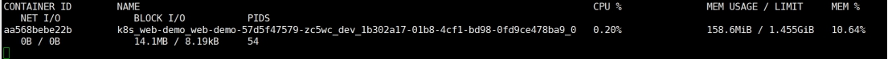 

模拟cpu占用

```
bash-4.4# dd if=/dev/zero of=/dev/null &
[1] 74
bash-4.4# dd if=/dev/zero of=/dev/null &
[2] 75
bash-4.4# dd if=/dev/zero of=/dev/null &
[3] 76
bash-4.4# dd if=/dev/zero of=/dev/null &
[4] 77
bash-4.4# dd if=/dev/zero of=/dev/null &
[5] 78
bash-4.4# killall dd
[1]  Terminated        dd if=/dev/zero of=/dev/null
[4]-  Terminated        dd if=/dev/zero of=/dev/null
```

可以看到cpu占用被限制在了4核心，

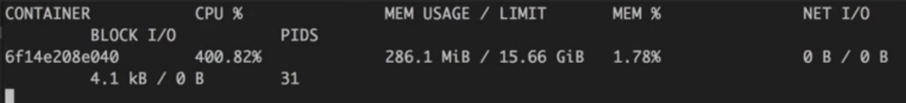 

运行的进程不会被杀掉，cpu是可压缩资源，你占用多了就给你少分点

 

Requests == limits   完全可靠，等级最高

不设置 Requests，limits   最不可靠，没有资源最先干掉

Limits>requests   比较可靠，出现资源竞争按照优先级处理

 

LimitRange测试

创建test 名称空间

[root@master ~]# kubectl create ns test

部署

[root@master ~]# kubectl apply -f limit_range.yaml -n test

查看

[root@master ~]# kubectl describe limits -n test

```
Name:    test-limits
Namespace:  test
Type     Resource  Min   Max  Default Request  Default Limit  Max Limit/Request Ratio
----     --------  ---   ---  ---------------  -------------  -----------------------
Pod     cpu    100m  4   -         -        3
Pod     memory   100Mi  2Gi  -         -        2
Container  cpu    100m  2   200m       300m      5
Container  memory   100Mi  1Gi  100Mi       200Mi      4
[root@master ~]#
```

测试

kubectl apply -f web-test.yaml 

查看详细信息

kubectl get deploy -n test web-demo -o yaml

Deployment的resources字段是空的

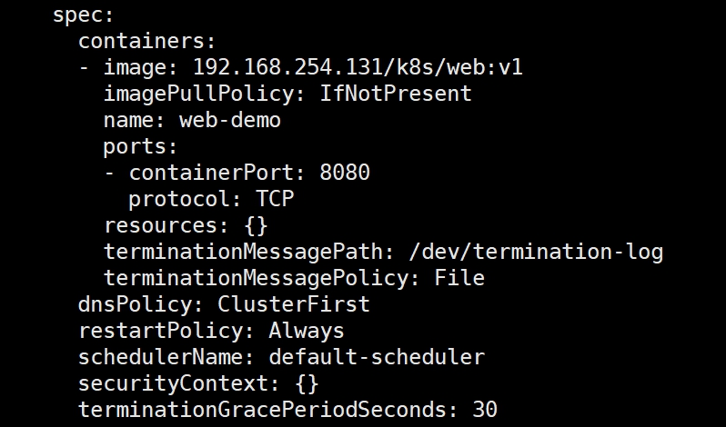 

查看pod的信息，yaml没配置resources字段使用的是limits_range配置的默认值

kubectl get pods -n test  -o yam

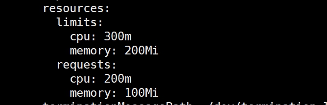 

 

修改web-test.yaml配置文件，limitRange配置的是cpu的limits最大可以比cpu的requests大3倍，

这里修改为20倍

```
#deploy
apiVersion: apps/v1
kind: Deployment
metadata:
  name: web-demo
  namespace: test
spec:
  selector:
  matchLabels:
    app: web-demo
  replicas: 1
  template:
    metadata:
     labels:
       app: web-demo
    spec:
      containers:
      - name: web-demo
        image: 192.168.254.131/k8s/web:v1
        ports:
        - containerPort: 8080
        resources:
          requests:
      #不加单位默认是字节数
            memory: 100Mi
       #不加m，表示100核心的cpu，100个cpu,1核心cpu == 1000m
            cpu: 100m
          limits:
            memory: 1000Mi
            cpu: 2000m
```

[root@master ~]# kubectl get deploy -n test

```
NAME    READY  UP-TO-DATE  AVAILABLE  AGE
web-demo  1/1   0       1      24m
```

UP-TO-DATE 是 0，说明web-demo没准备好

查看没啥异常

root@master ~]# kubectl describe  deploy -n test web-demo

查看配置文件信息

root@master ~]# kubectl get deploy -n test -o yaml

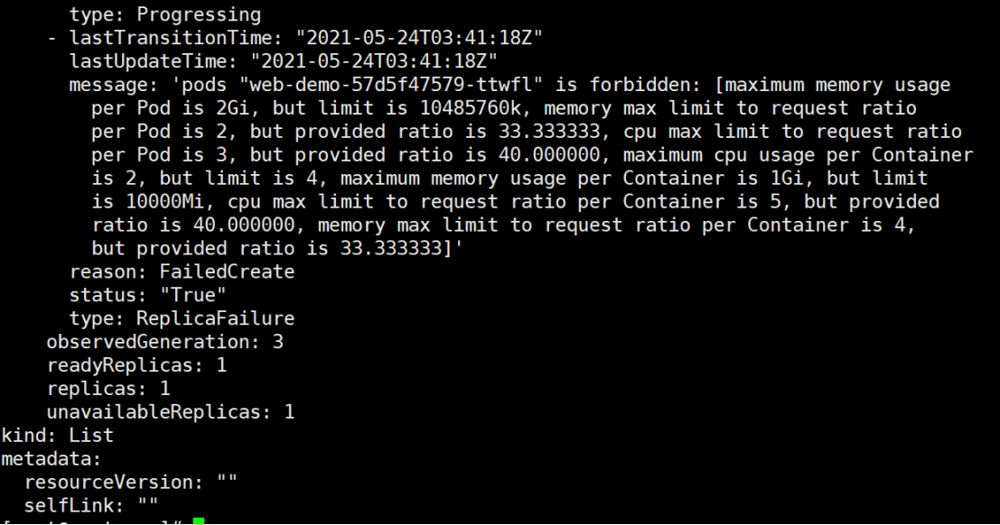 

看到超出了limit设置的，所以运行不成功，这是比例不正确的情况

 

下面看配置超限的情况，修改yaml文件

    ```
    resources:
      requests:
          #不加单位默认是字节数
        memory: 2000Mi
           #不加m，表示100核心的cpu，100个cpu,1核心cpu == 1000m
        cpu: 3000m
      limits:
        memory: 3000Mi
        cpu: 4000m
    ```

root@master ~]# kubectl get deploy -n test -o yaml

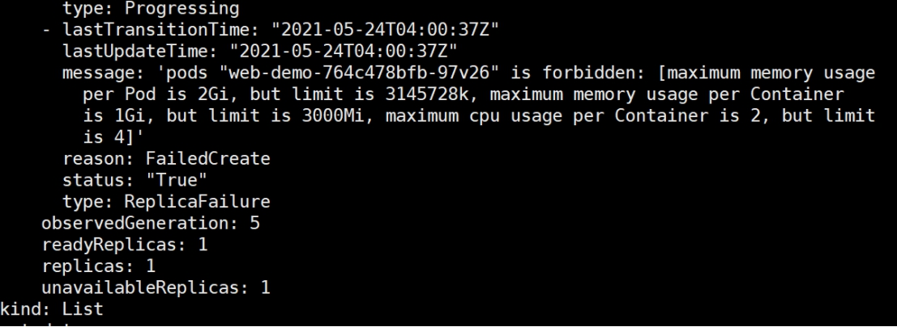 

可以看到资源超限也是不能运行的


资源配额，配置每个名称空间可以使用的资源

```
[root@master ~]# kubectl apply -f resouce-quota.yaml -n test
resourcequota/resource-quota created
[root@master ~]# kubectl apply -f object-counts.yaml -n test
resourcequota/object-counts created
[root@master ~]# kubectl get quota -n test
NAME       AGE  REQUEST                                                    LIMIT
object-counts   28s  configmaps: 0/10, persistentvolumeclaims: 0/4, replicationcontrollers: 0/20, secrets: 1/10, services: 0/10  
resource-quota  36s  pods: 1/4, requests.cpu: 1/2, requests.memory: 500Mi/4Gi                           limits.cpu: 2/4, limits.memory: 1000Mi/8Gi

[root@master ~]#
[root@master ~]# kubectl describe  quota object-counts -n test
Name:          object-counts
Namespace:        test
Resource         Used  Hard
--------         ----  ----
configmaps        0   10
persistentvolumeclaims  0   4
replicationcontrollers  0   20
secrets         1   10
services         0   10
[root@master ~]# 

[root@master ~]# kubectl describe  quota resource-quota -n test
Name:       resource-quota
Namespace:    test
Resource     Used   Hard

--------     ----   ----
limits.cpu    2    4
limits.memory   1000Mi  8Gi
pods       1    4
requests.cpu   1    2
requests.memory  500Mi  4Gi
[root@master ~]#
```

修改副本为5个，web-test.yaml

```
[root@master ~]# kubectl describe  quota resource-quota -n test
Name:       resource-quota
Namespace:    test
Resource     Used   Hard
--------     ----   ----
limits.cpu    4    4
limits.memory   2000Mi  8Gi
pods       2    4
requests.cpu   2    2
requests.memory  1000Mi  4Gi

[root@master ~]# kubectl get deploy -n test
NAME    READY  UP-TO-DATE  AVAILABLE  AGE
web-demo  2/5   0       2      3h33m
[root@master ~]# 
```

Cpu达到上限，不能再运行更多的pod，只运行了2个


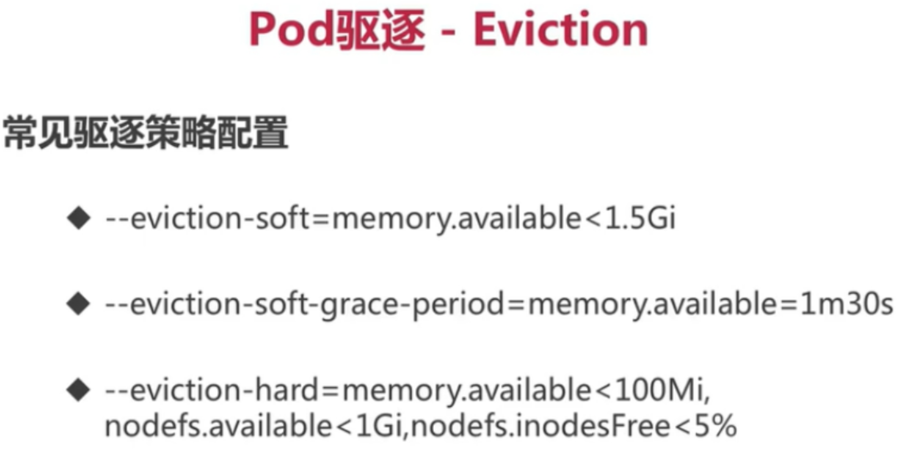 

 

内存小于1.5G并且持续1分30秒，就驱逐

内存小于100M，或者磁盘小于1G，或者inode小于5％就被驱逐


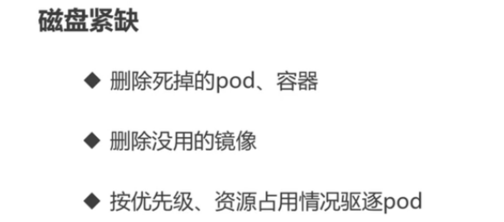 

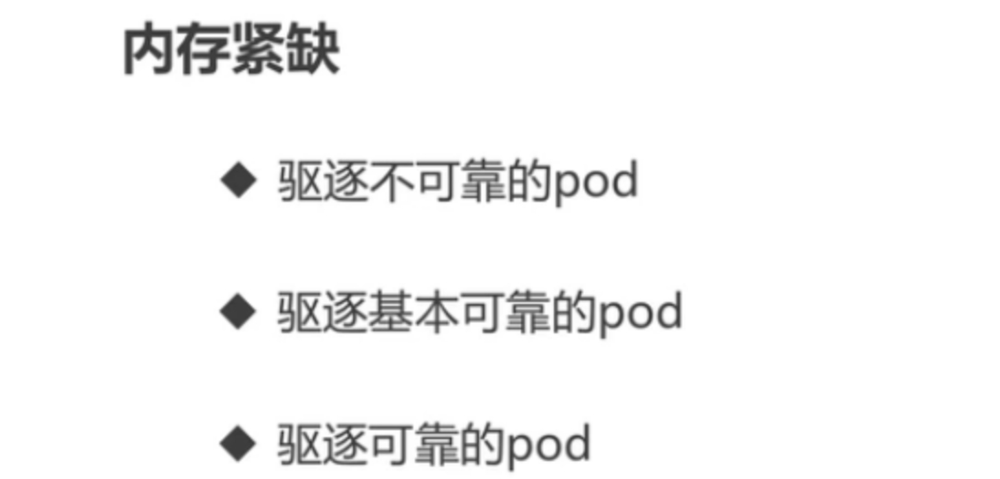 

 

 
