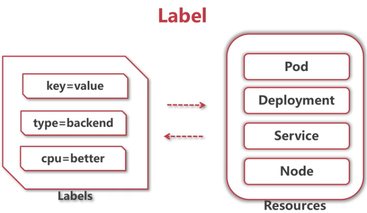
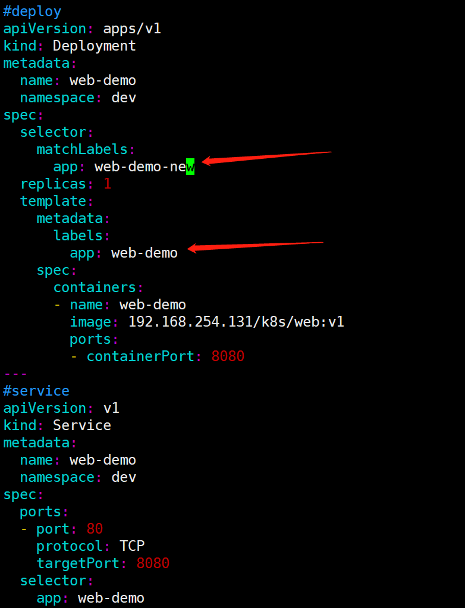
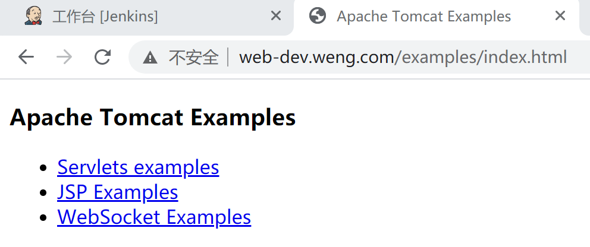
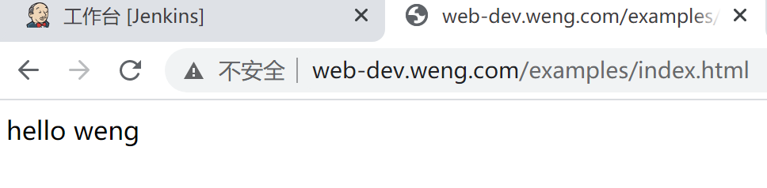

label的本质是key=value，需要注意，每个对象的标签key具有唯一性。



deployment配置了标签，其下面的pod也设置了标签，副本控制器就可以知道那些pod是自己的；区分节点，计算能力强的节点cpu=better，磁盘大的节点disk=better；区分类型后端服务type=backend等

selector下的matchLabels设置为和labels不一致



[root@master ~]# kubectl apply -f web-dev.yaml 
The Deployment "web-demo" is invalid: 

* spec.template.metadata.labels: Invalid value: map[string]string{"app":"web-demo"}: `selector` does not match template `labels`
* spec.selector: Invalid value: v1.LabelSelector{MatchLabels:map[string]string{"app":"web-demo-new"}, MatchExpressions:[]v1.LabelSelectorRequirement(nil)}: field is immutable
  [root@master ~]#

报错，不匹配，必须要一致，

把deployment的名字修改为`web-demo-new`

```
#deploy
apiVersion: apps/v1
kind: Deployment
metadata:
  name: web-demo-new
  namespace: dev
spec:
  selector:
    matchLabels:
      app: web-demo
  replicas: 1
  template:
    metadata:
      labels:
        app: web-demo
    spec:
      containers:
      - name: web-demo
        image: 192.168.254.131/k8s/web:v1
        ports:
        - containerPort: 8080
---
#service
apiVersion: v1
kind: Service
metadata:
  name: web-demo
  namespace: dev
spec:
  ports:
  - port: 80
    protocol: TCP
    targetPort: 8080
  selector:
    app: web-demo
  type: ClusterIP

---
#ingress
apiVersion: extensions/v1beta1
kind: Ingress
metadata:
  name: web-demo
  namespace: dev
spec:
  rules:
    - host: web-dev.weng.com
      http:
        paths:
          - path: /
            backend:
              serviceName: web-demo
              servicePort: 80
```

[root@master ~]# kubectl apply -f web-dev.yaml 

```
deployment.apps/web-demo-new created
service/web-demo unchanged
ingress.extensions/web-demo configured
[root@master ~]# kubectl get deploy -n dev
NAME           READY   UP-TO-DATE   AVAILABLE   AGE
web-demo       1/1     1            1           23h
web-demo-new   1/1     1            1           12m
[root@master ~]# 
```

有2个deployment,下面各有一个实例，说明，虽然在dev 名称空间有2个label 为 app=web-demo的pod，但是它们不会冲突，因为selector作用于副本控制器，副本控制器是属于deployment的，不同deployment就不会冲突,(不同的deployment下面有2个相同的副本控制器是不冲突的)

实际上运行了2个pod
[root@master ~]# kubectl get pods -n dev

```
NAME                            READY   STATUS    RESTARTS   AGE
web-demo-57d5f47579-zc5wc       1/1     Running   1          23h
web-demo-new-77b66c9d7d-75hg5   1/1     Running   0          28m
[root@master ~]# 
```

service的selector 是app: web-demo，通过这个selector可以发现带有这个key/value标签的pod

修改web-demo-57d5f47579-zc5wc的index.html

```
[root@master ~]# kubectl get pods -n dev
NAME                            READY   STATUS    RESTARTS   AGE
web-demo-57d5f47579-zc5wc       1/1     Running   1          24h
web-demo-new-77b66c9d7d-75hg5   1/1     Running   0          52m
[root@master ~]# kubectl exec -it web-demo-57d5f47579-zc5wc -n dev bash 
bash-4.4# cd /usr/local/tomcat/
bash-4.4# ls
LICENSE         RELEASE-NOTES   bin             include         logs            temp            work
NOTICE          RUNNING.txt     conf            lib             native-jni-lib  webapps
bash-4.4# cd webapps/
bash-4.4# ls
ROOT          docs          examples      host-manager  manager
bash-4.4# cd examples/
bash-4.4# ls
WEB-INF     index.html  jsp         servlets    websocket
bash-4.4# echo "hello weng" > index.html 
bash-4.4# pwd
/usr/local/tomcat/webapps/examples
bash-4.4#
```

访问，发现会轮询2个pod的html页面





说明service和deployment无关，它是通过label去选择所有带这个标签的pod

修改web-dev.yaml ，加上matchExpressions配置，和matchLabels是and的关系

```
#deploy
apiVersion: apps/v1
kind: Deployment
metadata:
  name: web-demo-new
  namespace: dev
spec:
  selector:
    matchLabels:
      app: web-demo
    matchExpressions:
      - {key: group,operator: In,values: [dev, test]}
  replicas: 1
  template:
    metadata:
      labels:
        app: web-demo
    spec:
      containers:
      - name: web-demo
        image: 192.168.254.131/k8s/web:v1
        ports:
        - containerPort: 8080
```

[root@master ~]# kubectl apply -f web-dev.yaml 

```
The Deployment "web-demo-new" is invalid: 
* spec.template.metadata.labels: Invalid value: map[string]string{"app":"web-demo"}: `selector` does not match template `labels`
* spec.selector: Invalid value: v1.LabelSelector{MatchLabels:map[string]string{"app":"web-demo"}, MatchExpressions:[]v1.LabelSelectorRequirement{v1.LabelSelectorRequirement{Key:"group", Operator:"In", Values:[]string{"dev", "test"}}}}: field is immutable
[root@master ~]# 
```

`selector` does not match template `labels`，再修改增加group: dev

```
#deploy
apiVersion: apps/v1
kind: Deployment
metadata:
  name: web-demo-new
  namespace: dev
spec:
  selector:
    matchLabels:
      app: web-demo
    matchExpressions:
      - {key: group,operator: In,values: [dev, test]}
  replicas: 1
  template:
    metadata:
      labels:
        group: dev
        app: web-demo
    spec:
      containers:
      - name: web-demo
        image: 192.168.254.131/k8s/web:v1
        ports:
        - containerPort: 8080
```

PodPreset预设置，template下的配置可以通过这个来统一管理

[root@master ~]# kubectl apply -f web-dev.yaml 
The Deployment "web-demo-new" is invalid: spec.selector: Invalid value: v1.LabelSelector{MatchLabels:map[string]string{"app":"web-demo"}, MatchExpressions:[]v1.LabelSelectorRequirement{v1.LabelSelectorRequirement{Key:"group", Operator:"In", Values:[]string{"dev", "test"}}}}: field is immutable

**selector一旦创建了，就不能再修改，需要先删除先前创建的**

[root@master ~]# kubectl  get pods -l app=web-demo,group=dev -n dev

```
NAME                            READY   STATUS    RESTARTS   AGE
web-demo-new-68474fcf9b-86744   1/1     Running   0          6m4s
[root@master ~]# 
```

[root@master ~]# kubectl  get pods -l 'group in (dev,test)' -n dev

```
NAME                            READY   STATUS    RESTARTS   AGE
web-demo-new-68474fcf9b-86744   1/1     Running   0          7m3s
```

[root@master ~]# kubectl  get pods -l 'group notin (dev)' -n dev

```
NAME                        READY   STATUS    RESTARTS   AGE
web-demo-57d5f47579-zc5wc   1/1     Running   1          25h
[root@master ~]# 
```

修改web-dev.yaml ，加上nodeSlector配置

```
apiVersion: apps/v1
kind: Deployment
metadata:
  name: web-demo-new
  namespace: dev
spec:
  selector:
    matchLabels:
      app: web-demo
    matchExpressions:
      - {key: group, operator: In, values: [dev, test]}
  replicas: 1
  template:
    metadata:
      labels:
        group: dev
        app: web-demo
    spec:
      containers:
      - name: web-demo
        image: 192.168.254.131/k8s/web:v1
        ports:
        - containerPort: 8080
      nodeSelector:
        disktype: ssd
```

[root@master ~]# kubectl get pods -n dev

```
NAME                            READY   STATUS    RESTARTS   AGE
web-demo-57d5f47579-zc5wc       1/1     Running   1          25h
web-demo-new-6488946f94-dqn8v   0/1     Pending   0          88s
web-demo-new-68474fcf9b-86744   1/1     Running   0          11m
[root@master ~]#
```

没有找到合适的节点去调度，

给node1节点加上disktype: ssd标签，pod会被调度到node1上

[root@master ~]# kubectl label node node1 disktype=ssd

[root@master ~]# kubectl get pods -n dev

```
NAME                            READY   STATUS        RESTARTS   AGE
web-demo-57d5f47579-zc5wc       1/1     Running       1          25h
web-demo-new-6488946f94-dqn8v   1/1     Running       0          3m18s
web-demo-new-68474fcf9b-86744   1/1     Terminating   0          12m
[root@master ~]# kubectl get nodes --show-labels
NAME     STATUS   ROLES    AGE    VERSION   LABELS
master   Ready    master   7d4h   v1.18.0   beta.kubernetes.io/arch=amd64,beta.kubernetes.io/os=linux,kubernetes.io/arch=amd64,kubernetes.io/hostname=master,kubernetes.io/os=linux,node-role.kubernetes.io/master=
node1    Ready    <none>   7d4h   v1.18.0   app=ingress,beta.kubernetes.io/arch=amd64,beta.kubernetes.io/os=linux,disktype=ssd,kubernetes.io/arch=amd64,kubernetes.io/hostname=node1,kubernetes.io/os=linux
node2    Ready    <none>   7d4h   v1.18.0   beta.kubernetes.io/arch=amd64,beta.kubernetes.io/os=linux,kubernetes.io/arch=amd64,kubernetes.io/hostname=node2,kubernetes.io/os=linux
[root@master ~]
```

