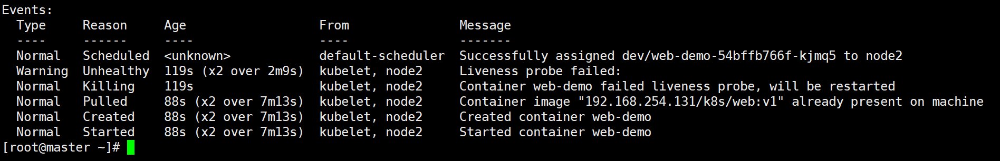

### cmd检查

[root@master ~]# kubectl get pods -n dev

```
NAME                            READY   STATUS    RESTARTS   AGE
web-demo-57d5f47579-zc5wc       1/1     Running   1          42h
web-demo-new-6488946f94-dqn8v   1/1     Running   0          17h
[root@master ~]# kubectl exec -it web-demo-57d5f47579-zc5wc bash
kubectl exec [POD] [COMMAND] is DEPRECATED and will be removed in a future version. Use kubectl kubectl exec [POD] -- [COMMAND] instead.
Error from server (NotFound): pods "web-demo-57d5f47579-zc5wc" not found
[root@master ~]# kubectl exec -it web-demo-57d5f47579-zc5wc -n dev  bash
kubectl exec [POD] [COMMAND] is DEPRECATED and will be removed in a future version. Use kubectl kubectl exec [POD] -- [COMMAND] instead.
bash-4.4# ps -ef
PID   USER     TIME   COMMAND
    1 root       0:00 sh /usr/local/tomcat/bin/start.sh
   13 root       2:21 /usr/lib/jvm/java-1.7-openjdk/jre/bin/java -Djava.util.logging.config.file=/usr/local/tomcat/conf/logging.properties -
   14 root       0:01 tail -f /usr/local/tomcat/logs/catalina.out
  109 root       0:00 bash
  114 root       0:00 ps -ef
bash-4.4# kill 13
bash-4.4# ps -ef
PID   USER     TIME   COMMAND
    1 root       0:00 sh /usr/local/tomcat/bin/start.sh
   14 root       0:01 tail -f /usr/local/tomcat/logs/catalina.out
  109 root       0:00 bash
  122 root       0:00 ps -ef
bash-4.4# 
```

把web-demo-57d5f47579-zc5wc的java进程杀掉，再访问，发现service在负载均衡的时候，如果服务端口不存在，这个pod就不会被轮询


```
bash-4.4# ps -ef
PID   USER     TIME   COMMAND
    1 root       0:00 sh /usr/local/tomcat/bin/start.sh
   14 root       0:01 tail -f /usr/local/tomcat/logs/catalina.out
  109 root       0:00 bash
  124 root       0:00 ps -ef
bash-4.4# kill -9 1
bash-4.4# ps -ef
PID   USER     TIME   COMMAND
    1 root       0:00 sh /usr/local/tomcat/bin/start.sh
   14 root       0:01 tail -f /usr/local/tomcat/logs/catalina.out
  109 root       0:00 bash
  125 root       0:00 ps -ef
bash-4.4# kill 14
bash-4.4# command terminated with exit code 137
[root@master ~]# 
```

杀掉14号进程后，pod重启了，因为容器的入口程序退出了，kubernetes在没有健康检查的情况下，只有当入口程序退出了，才会重启pod。

shell=执行命令，有个退出值，当退出值=0，这个命令执行正确(成功)；非0执行失败，健康检查不会通过，会重启pod

```
#deploy
apiVersion: apps/v1
kind: Deployment
metadata:
  name: web-demo
  namespace: dev
spec:
  selector:
    matchLabels:
      app: web-demo
  replicas: 1
  template:
    metadata:
      labels:
        app: web-demo
    spec:
      containers:
      - name: web-demo
        image: 192.168.254.131/k8s/web:v1
        ports:
        - containerPort: 8080
        livenessProbe:
          exec:
            command:
            - /bin/bash
            - -c
            - ps -ef|grep java|grep -v grep
            #等待容器启动10秒后才执行上面的命令
          initialDelaySeconds: 10
          #每隔10秒检查一次
          periodSeconds: 10
          #健康检查的命令连续执行失败2次认为健康检查失败
          failureThreshold: 2
          #成功一次就认为健康检查成功
          successThreshold: 1
          #执行命令的等待时间，超过5秒也认为检查失败
          timeoutSeconds: 5
---
#service
apiVersion: v1
kind: Service
metadata:
  name: web-demo
  namespace: dev
spec:
  ports:
  - port: 80
    protocol: TCP
    targetPort: 8080
  selector:
    app: web-demo
  type: ClusterIP

---
#ingress
apiVersion: extensions/v1beta1
kind: Ingress
metadata:
  name: web-demo
  namespace: dev
spec:
  rules:
    - host: web-dev.weng.com
      http:
        paths:
          - path: /
            backend:
              serviceName: web-demo
              servicePort: 80
```

[root@master ~]# kubectl apply -f web-dev-cmd.yaml 

[root@master ~]# kubectl get pod -n dev

```
NAME                            READY   STATUS        RESTARTS   AGE
web-demo-54bffb766f-kjmq5       1/1     Running       0          16s
web-demo-57d5f47579-zc5wc       1/1     Terminating   2          43h
web-demo-new-6488946f94-dqn8v   1/1     Running       0          17h
```

[root@master ~]# kubectl describe pods -n dev web-demo-54bffb766f-kjmq5


可以看到配置生效了

进入pod，杀掉java进程，过20秒就退出了

```
[root@master ~]# kubectl get pod -n dev
NAME                            READY   STATUS    RESTARTS   AGE
web-demo-54bffb766f-kjmq5       1/1     Running   0          4m20s
web-demo-new-6488946f94-dqn8v   1/1     Running   0          17h
[root@master ~]# kubectl exec -it  web-demo-54bffb766f-kjmq5 -n dev bash
bash-4.4# 
bash-4.4# ps -ef
PID   USER     TIME   COMMAND
    1 root       0:00 sh /usr/local/tomcat/bin/start.sh
   13 root       0:11 /usr/lib/jvm/java-1.7-openjdk/jre/bin/java -Djava.util.logging.config.file=/usr/local/tomcat/conf/logging.properties -
   14 root       0:00 tail -f /usr/local/tomcat/logs/catalina.out
  279 root       0:00 bash
  292 root       0:00 ps -ef
bash-4.4# kill 13
bash-4.4# command terminated with exit code 137
[root@master ~]#
```

[root@master ~]#kubectl describe pods web-demo-54bffb766f-kjmq5 -n dev



可以看到存活检测失败，pod重启

### http检查

```
#deploy
apiVersion: apps/v1
kind: Deployment
metadata:
  name: web-demo
  namespace: dev
spec:
  selector:
    matchLabels:
      app: web-demo
  replicas: 1
  template:
    metadata:
      labels:
        app: web-demo
    spec:
      containers:
      - name: web-demo
        image: 192.168.254.131/k8s/web:v1
        ports:
        - containerPort: 8080
        livenessProbe:
          httpGet:
          #访问状态码不是200都认为健康检查失败
            path: /examples/index.html
            port: 8080
            scheme: HTTP
            #等待容器启动5秒后才执行上面的命令
          initialDelaySeconds: 5
          #每隔5秒检查一次
          periodSeconds: 5
          #健康检查的命令连续执行失败1次认为健康检查失败
          failureThreshold: 1
          #成功一次就认为健康检查成功
          successThresgold: 1
          #执行命令的等待时间，超过5秒也认为检查失败
          timeoutSeconds: 5
```

[root@master ~]# kubectl apply -f web-dev-http.yaml

[root@master ~]# kubectl get pods -n dev   看到pod一致在重启


浏览器访问，发现一直转圈圈，

[root@master ~]#kubectl describe pods web-demo-54bffb766f-kjmp5-n dev


发现是超时了，配置健康检查的时间设置的不合理导致。程序在设置的时间内不能对外提供服务，导致一直重启

这里还存在一个问题，service轮询的时候还会轮到这个有问题的pod，因为它的端口已经启动了，可以使用`readinnessProbe`解决这个问题

### tcp检查

```
#deploy
apiVersion: apps/v1
kind: Deployment
metadata:
  name: web-demo
  namespace: dev
spec:
  selector:
    matchLabels:
      app: web-demo
  replicas: 1
  template:
    metadata:
      labels:
        app: web-demo
    spec:
      containers:
      - name: web-demo
        image: 192.168.254.131/k8s/web:v1
        ports:
        - containerPort: 8080
        livenessProbe:
          tcpSocket:
            port: 8080
            #等待容器启动10秒后才执行上面的命令
          initialDelaySeconds: 20
          #每隔10秒检查一次
          periodSeconds: 10
          #健康检查的命令连续执行失败2次认为健康检查失败
          failureThreshold: 2
          #成功一次就认为健康检查成功
          successThreshold: 1
          #执行命令的等待时间，超过5秒也认为检查失败
          timeoutSeconds: 5
        readinessProbe:
          httpGet:
          #访问状态码不是200都认为健康检查失败
            path: /examples/index.html
            port: 8080
            scheme: HTTP
            #等待容器启动10秒后才执行上面的命令
          initialDelaySeconds: 20
          #每隔10秒检查一次
          periodSeconds: 10
          #健康检查的命令连续执行失败2次认为健康检查失败
          failureThreshold: 2
          #成功一次就认为健康检查成功
          successThreshold: 1
          #执行命令的等待时间，超过5秒也认为检查失败
          timeoutSeconds: 5
---
#service
apiVersion: v1
kind: Service
metadata:
  name: web-demo
  namespace: dev
spec:
  ports:
  - port: 80
    protocol: TCP
    targetPort: 8080
  selector:
    app: web-demo
  type: ClusterIP

---
#ingress
apiVersion: extensions/v1beta1
kind: Ingress
metadata:
  name: web-demo
  namespace: dev
spec:
  rules:
    - host: web-dev.weng.com
      http:
        paths:
          - path: /
            backend:
              serviceName: web-demo
              servicePort: 80

```

[root@master ~]# kubectl get pods -n dev

```
NAME                            READY   STATUS    RESTARTS   AGE
web-demo-74ffb64465-7cbd6       1/1     Running   0          9m17s
web-demo-cb6ccfbbc-z685v        0/1     Running   0          4s
web-demo-new-6488946f94-dqn8v   1/1     Running   0          20h
[root@master ~]# 
```

READY状态是0，说明还没通过`readinnessProbe`的健康检查

[root@master ~]# kubectl get deploy -n dev

````
NAME           READY   UP-TO-DATE   AVAILABLE   AGE
web-demo       1/1     1            1           161m
web-demo-new   1/1     1            1           20h
[root@master ~]# 
```

`AVAILABLE`字段是1 说明通过了`readinness`检查

通过这个检查说明这个程序可以对外访问了，可以把我放到负载均衡上去了

容器restart发生的频率非常低，几天，几十天，可以把restart策略从always改成none，健康检查失败的时候就不会重启，会把上下文保存下来，可以拿到更多的信息去查问题；

如果是一只起不来，先把`livenessProbe`去掉，或者执行简单的命令让它通过检查，再查看信息；