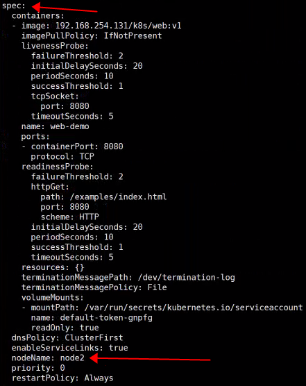
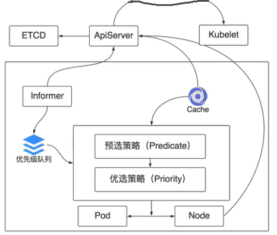
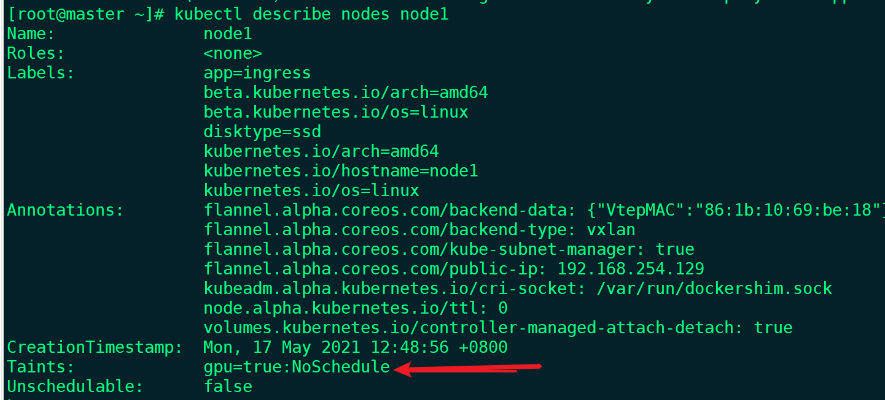

scheduler调度流程

kubernetes要先知道要调度哪个pod，要知道pod的信息，pod信息去哪拿，kubernetes设计了一个优先级队列，存储等待调度的pod列表，优先级高提前出队，scheduler的模块informer，通过apiserver去监听etcd的数据变化（如发现新的pod，新增的pod和普通pod区别，新增的pod会少一个配置，刚刚创建的pod是不存在这个字段的，只有经过调度器调度后才知道运行在哪个节点，也就是加上这个配置。），informer发现了一个等待调度的pod，把信息放到优先级队列中，一直循环监听，没调度一个pod就去apiserver请求信息，性能差，kubernetes设计了cache，cache从apiserver拿到想要的数据缓存起来，节点列表，节点详细信息，cpu，内存，磁盘，镜像，节点运行了哪些pod，pod的详细信息。拿到cache和优先级队列信息，可以开始进行调度，

预选策略，内存\cpu\端口冲突、节点状态等，nodeSelector属于预选策略

优选策略，对上一步筛选出来的node进行评分，节点亲和性、污点等

最终选出一个合适的node节点，pod和节点形成绑定关系，绑定信息告诉apiserver，apiserver更新pod的nodeName字段，然后指派给kubectl，kubelet把服务调度起来。

kubectl get pod -n dev web-demo-cb6ccfbbc-z685v -o yaml

sepc字段下的nodeName字段





### 节点亲和性

web-dev-node.yaml

```yaml
#deploy
apiVersion: apps/v1
kind: Deployment
metadata:
  name: web-demo-node
  namespace: dev
spec:
  selector:
    matchLabels:
      app: web-demo-node
  replicas: 1
  template:
    metadata:
      labels:
        app: web-demo-node
    spec:
      containers:
      - name: web-demo-node
        image: 192.168.254.131/k8s/web:v1
        ports:
        - containerPort: 8080
      affinity:
        nodeAffinity:
        #必须是满足以下条件的key/value才能被调度
          requiredDuringSchedulingIgnoredDuringExecution:
            nodeSelectorTerms:
            - matchExpressions:
              - key: beta.kubernetes.io/arch
                operator: In
                values:
                - amd64
          #最好满足以下条件的key/value，不满足也可以被调度
          preferredDuringSchedulingIgnoredDuringExecution:
          - weight: 1
          #有多个时根据权重调度
            preference:
              matchExpressions:
              - key: disktype
                operator: NotIn
                values:
                - ssd
```

[root@master ~]# kubectl get nodes --show-labels

```shell
NAME     STATUS   ROLES    AGE   VERSION   LABELS
master   Ready    master   10d   v1.18.0   beta.kubernetes.io/arch=amd64,beta.kubernetes.io/os=linux,kubernetes.io/arch=amd64,kubernetes.io/hostname=master,kubernetes.io/os=linux,node-role.kubernetes.io/master=
node1    Ready    <none>   10d   v1.18.0   app=ingress,beta.kubernetes.io/arch=amd64,beta.kubernetes.io/os=linux,disktype=ssd,kubernetes.io/arch=amd64,kubernetes.io/hostname=node1,kubernetes.io/os=linux
node2    Ready    <none>   10d   v1.18.0   beta.kubernetes.io/arch=amd64,beta.kubernetes.io/os=linux,kubernetes.io/arch=amd64,kubernetes.io/hostname=node2,kubernetes.io/os=linux
[root@master ~]#
```

看到调度在node2上

[root@master ~]# kubectl get pods -n dev -o wide

```shell
NAME                            READY   STATUS    RESTARTS   AGE     IP            NODE    NOMINATED NODE   READINESS GATES
web-demo-cb6ccfbbc-z685v        1/1     Running   0          2d1h    10.244.2.54   node2   <none>           <none>
web-demo-new-6488946f94-dqn8v   1/1     Running   0          2d22h   10.244.1.69   node1   <none>           <none>
web-demo-node-5c99476d8-pf5mg   1/1     Running   0          16s     10.244.2.55   node2   <none>           <none>
```

修改为

```yaml
	  affinity:
        nodeAffinity:
          requiredDuringSchedulingIgnoredDuringExecution:
            nodeSelectorTerms:
            - matchExpressions:
              - key: beta.kubernetes.io/arch
                operator: In
                values:
                - amd
```

[root@master ~]# kubectl get pods -n dev -o wide

```shell
NAME                             READY   STATUS    RESTARTS   AGE     IP            NODE     NOMINATED NODE   READINESS GATES
web-demo-cb6ccfbbc-z685v         1/1     Running   0          2d2h    10.244.2.54   node2    <none>           <none>
web-demo-new-6488946f94-dqn8v    1/1     Running   0          2d22h   10.244.1.69   node1    <none>           <none>
web-demo-node-7b74cbf5fd-ghhjw   0/1     Pending   0          39s     <none>        <none>   <none>           <none>
[root@master ~]#
```

查看pending原因，kubectl describe  pods -n dev  web-demo-node-7b74cbf5fd-ghhjw

  Warning  FailedScheduling  <unknown>  default-scheduler  0/3 nodes are available: 3 node(s) didn't match node selector.

可以看出`requiredDuringSchedulingIgnoredDuringExecution`:这个字段下有条件不满足pod就不会被调度。


同时指定nodeSelector and nodeAffinity，pod必须都满足

nodeAffinity有多个nodeSelectorTerms ，pod只需满足一个

nodeSelectorTerms多个matchExpressions ，pod必须都满足

由于IgnoredDuringExecution，所以改变labels不会影响已经运行pod


修改为

```
        preferredDuringSchedulingIgnoredDuringExecution:
          - weight: 1
            preference:
              matchExpressions:
              - key: disktype
                operator: In
                values:
                - ss
```

[root@master ~]# kubectl apply  -f web-dev-node.yaml 
deployment.apps/web-demo-node configured

```
[root@master ~]# kubectl get pods -o wide -n dev
NAME                             READY   STATUS        RESTARTS   AGE     IP            NODE    NOMINATED NODE   READINESS GATES
web-demo-cb6ccfbbc-z685v         1/1     Running       1          5d      10.244.2.57   node2   <none>           <none>
web-demo-new-6488946f94-dqn8v    1/1     Running       1          5d21h   10.244.1.72   node1   <none>           <none>
web-demo-node-6d5fc66dc8-pmhfw   1/1     Running       0          4s      10.244.2.59   node2   <none>           <none>
web-demo-node-d8f987689-lgzkl    1/1     Terminating   0          32s     10.244.2.58   node2   <none>           <none>
[root@master ~]#
```

`preferredDuringSchedulingIgnoredDuringExecution`:这个字段下条件不满足pod可以被调度，

### pod亲和性

一个区域范围内，pod和pod之间的亲和关系，如想和哪些pod运行在一起

```yaml
#deploy
apiVersion: apps/v1
kind: Deployment
metadata:
  name: web-demo-node
  namespace: dev
spec:
  selector:
    matchLabels:
      app: web-demo-pod
  replicas: 1
  template:
    metadata:
      labels:
        app: web-demo-pod
    spec:
      containers:
      - name: web-demo-pod
        image: 192.168.254.131/k8s/web:v1
        ports:
        - containerPort: 8080
      affinity:
        podAffinity:
          requiredDuringSchedulingIgnoredDuringExecution:
          - labelSelector:
              matchExpressions:
              - key: app
                operator: In
                values:
                - web-demo
            topologyKey: kubernetes.io/hostname
          preferredDuringSchedulingIgnoredDuringExecution:
          - weight: 100
            podAffinityTerm:
              labelSelector:
                matchExpressions:
                - key: app
                  operator: In
                  values:
                  - web-demo-node
              topologyKey: kubernetes.io/hostname
```

要跟app=web-demo的pod运行在一起，在什么范围呢，topologyKey:对应的值是节点的label名字，每个节点都有这个label，所有是节点范围，即要跟app=web-demo的pod运行在同一个节点上；

[root@master ~]# kubectl get nodes --show-labels

```
NAME     STATUS   ROLES    AGE   VERSION   LABELS
master   Ready    master   10d   v1.18.0   beta.kubernetes.io/arch=amd64,beta.kubernetes.io/os=linux,kubernetes.io/arch=amd64,kubernetes.io/hostname=master,kubernetes.io/os=linux,node-role.kubernetes.io/master=
node1    Ready    <none>   10d   v1.18.0   app=ingress,beta.kubernetes.io/arch=amd64,beta.kubernetes.io/os=linux,disktype=ssd,kubernetes.io/arch=amd64,kubernetes.io/hostname=node1,kubernetes.io/os=linux
node2    Ready    <none>   10d   v1.18.0   beta.kubernetes.io/arch=amd64,beta.kubernetes.io/os=linux,kubernetes.io/arch=amd64,kubernetes.io/hostname=node2,kubernetes.io/os=linux
[root@master ~]#
```

```
[root@master ~]# kubectl apply  -f web-dev-pod.yml 
deployment.apps/web-demo-pod created
[root@master ~]# kubectl get pods -o wide -n dev
NAME                             READY   STATUS    RESTARTS   AGE     IP            NODE    NOMINATED NODE   READINESS GATES
web-demo-cb6ccfbbc-z685v         1/1     Running   1          5d      10.244.2.57   node2   <none>           <none>
web-demo-new-6488946f94-dqn8v    1/1     Running   1          5d21h   10.244.1.72   node1   <none>           <none>
web-demo-node-7cd5d7ccc9-8r2z2   1/1     Running   0          2m34s   10.244.2.60   node2   <none>           <none>
web-demo-pod-64f848b85-vg8gv     1/1     Running   0          5s      10.244.2.61   node2   <none>           <none>
[root@master ~]# kubectl get pods -o wide -n dev
NAME                             READY   STATUS    RESTARTS   AGE     IP            NODE    NOMINATED NODE   READINESS GATES
web-demo-cb6ccfbbc-z685v         1/1     Running   1          5d      10.244.2.57   node2   <none>           <none>
web-demo-new-6488946f94-dqn8v    1/1     Running   1          5d21h   10.244.1.72   node1   <none>           <none>
web-demo-node-7cd5d7ccc9-8r2z2   1/1     Running   0          2m35s   10.244.2.60   node2   <none>           <none>
web-demo-pod-64f848b85-vg8gv     1/1     Running   0          6s      10.244.2.61   node2   <none>           <none>
```

requiredDuringSchedulingIgnoredDuringExecution:字段代表必须和app=web-demo的pod运行在同一个节点上，如果没有这样的label，pod无法被调度，处于pending状态。

修改文件app=web-demo2

```
		requiredDuringSchedulingIgnoredDuringExecution:
          - labelSelector:
              matchExpressions:
              - key: app
                operator: In
                values:
                - web-demo2
```

[root@master ~]# kubectl apply  -f web-dev-pod.yml 

```

deployment.apps/web-demo-pod configured
[root@master ~]# kubectl get pods -o wide -n dev
NAME                             READY   STATUS    RESTARTS   AGE     IP            NODE     NOMINATED NODE   READINESS GATES
web-demo-cb6ccfbbc-z685v         1/1     Running   1          5d1h    10.244.2.57   node2    <none>           <none>
web-demo-new-6488946f94-dqn8v    1/1     Running   1          5d21h   10.244.1.72   node1    <none>           <none>
web-demo-node-7cd5d7ccc9-8r2z2   1/1     Running   0          10m     10.244.2.60   node2    <none>           <none>
web-demo-pod-64f848b85-vg8gv     1/1     Running   0          8m12s   10.244.2.61   node2    <none>           <none>
web-demo-pod-66789bb6c7-66rcw    0/1     Pending   0          2s      <none>        <none>   <none>           <none>
```

### 反亲和性

```
#deploy
apiVersion: apps/v1
kind: Deployment
metadata:
  name: web-demo-node
  namespace: dev
spec:
  selector:
    matchLabels:
      app: web-demo-pod
  replicas: 1
  template:
    metadata:
      labels:
        app: web-demo-pod
    spec:
      containers:
      - name: web-demo-pod
        image: 192.168.254.131/k8s/web:v1
        ports:
        - containerPort: 8080
      affinity:
        podAntiAffinity:
          requiredDuringSchedulingIgnoredDuringExecution:
          - labelSelector:
              matchExpressions:
              - key: app
                operator: In
                values:
                - web-demo
            topologyKey: kubernetes.io/hostname
          preferredDuringSchedulingIgnoredDuringExecution:
          - weight: 100
            podAffinityTerm:
              labelSelector:
                matchExpressions:
                - key: app
                  operator: In
                  values:
                  - web-demo-node
              topologyKey: kubernetes.io/hostname
```

不要跟app=web-demo-node的pod运行在一起，

```
[root@master ~]# kubectl get pods -o wide -n dev
NAME                             READY   STATUS        RESTARTS   AGE     IP            NODE    NOMINATED NODE   READINESS GATES
web-demo-cb6ccfbbc-z685v         1/1     Running       1          5d1h    10.244.2.57   node2   <none>           <none>
web-demo-new-6488946f94-dqn8v    1/1     Running       1          5d21h   10.244.1.72   node1   <none>           <none>
web-demo-node-7cd5d7ccc9-8r2z2   1/1     Running       0          13m     10.244.2.60   node2   <none>           <none>
web-demo-pod-64f848b85-vg8gv     1/1     Terminating   0          11m     10.244.2.61   node2   <none>           <none>
web-demo-pod-bd647fb5-fzbw9      1/1     Running       0          5s      10.244.1.74   node1   <none>           <none>
[root@master ~]#
```

不跟自己运行在同一台机器上，label改为和自己一样，replicas设置为2，2个pod运行在不同的节点上

```
		podAntiAffinity:
          requiredDuringSchedulingIgnoredDuringExecution:
          - labelSelector:
              matchExpressions:
              - key: app
                operator: In
                values:
                - web-demo-pod
            topologyKey: kubernetes.io/hostname
```

[root@master ~]# kubectl get pods -o wide -n dev

```
NAME                             READY   STATUS    RESTARTS   AGE     IP            NODE    NOMINATED NODE   READINESS GATES
web-demo-cb6ccfbbc-z685v         1/1     Running   1          5d1h    10.244.2.57   node2   <none>           <none>
web-demo-new-6488946f94-dqn8v    1/1     Running   1          5d21h   10.244.1.72   node1   <none>           <none>
web-demo-node-7cd5d7ccc9-8r2z2   1/1     Running   0          20m     10.244.2.60   node2   <none>           <none>
web-demo-pod-66c5bdb957-bmktm    1/1     Running   0          63s     10.244.1.76   node1   <none>           <none>
web-demo-pod-66c5bdb957-r72pq    1/1     Running   0          63s     10.244.2.63   node2   <none>           <none>
[root@master ~]#
```

分别运行在node1和node2上，如果想让2个pod运行在同一个节点上，把`podAntiAffinity`改为`podAffinity`即可

### 污点和污点容忍

某个节点想单独给某些类型或某几个应用使用，可以给这个节点打上污点，其他pod进行正常调度的时候是不会调度到这台节点的，

给特定应用的pod设置污点容忍。

node1设置污点，PreferredNoSchedule,最好不要调度， Noexectue：除了不调度之外，如果有在运行的pod会被强制停止，没有设置容忍时间的话。

```
[root@master ~]#  kubectl taint nodes node1 gpu=true:NoSchedule
node/node1 tainted
[root@master ~]#
```

把副本数改为3

```
#deploy
apiVersion: apps/v1
kind: Deployment
metadata:
  name: web-demo-taint
  namespace: dev
spec:
  selector:
    matchLabels:
      app: web-demo-taint
  replicas: 3
  template:
    metadata:
      labels:
        app: web-demo-taint
    spec:
      containers:
      - name: web-demo-taint
        image: 192.168.254.131/k8s/web:v1
        ports:
        - containerPort: 8080
      tolerations:
      - key: "gpu"
        operator: "Equal"
        value: "true"
        effect: "NoSchedule"
```

可以看到node1上运行了一个pod

```
[root@master ~]# kubectl get pods -o wide -n dev
NAME                              READY   STATUS    RESTARTS   AGE     IP            NODE    NOMINATED NODE   READINESS GATES
web-demo-cb6ccfbbc-z685v          1/1     Running   1          5d1h    10.244.2.57   node2   <none>           <none>
web-demo-new-6488946f94-dqn8v     1/1     Running   1          5d22h   10.244.1.72   node1   <none>           <none>
web-demo-node-7cd5d7ccc9-8r2z2    1/1     Running   0          39m     10.244.2.60   node2   <none>           <none>
web-demo-pod-66c5bdb957-bmktm     1/1     Running   0          20m     10.244.1.76   node1   <none>           <none>
web-demo-pod-66c5bdb957-r72pq     1/1     Running   0          20m     10.244.2.63   node2   <none>           <none>
web-demo-taint-65c5bdcdc5-4mf98   1/1     Running   0          4s      10.244.2.65   node2   <none>           <none>
web-demo-taint-65c5bdcdc5-w7bdz   1/1     Running   0          50s     10.244.2.64   node2   <none>           <none>
web-demo-taint-65c5bdcdc5-zjjjj   1/1     Running   0          4s      10.244.1.77   node1   <none>           <none>
```

查看污点

[root@master ~]# kubectl describe nodes node1



删除污点

```
[root@master ~]# kubectl taint nodes node1 gpu=true:NoSchedule-
node/node1 untainted
```
