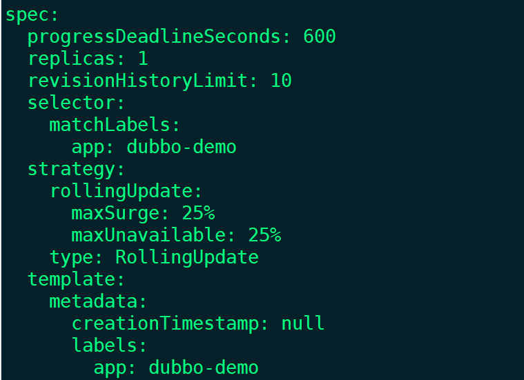
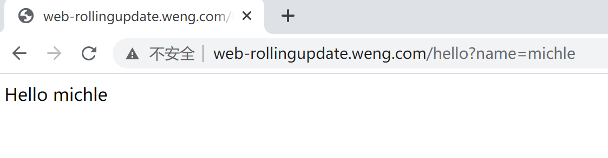
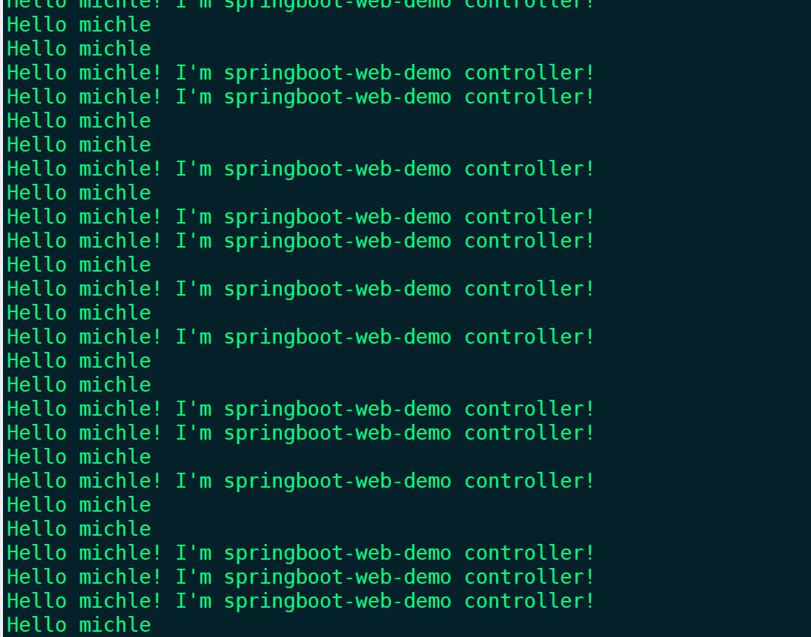
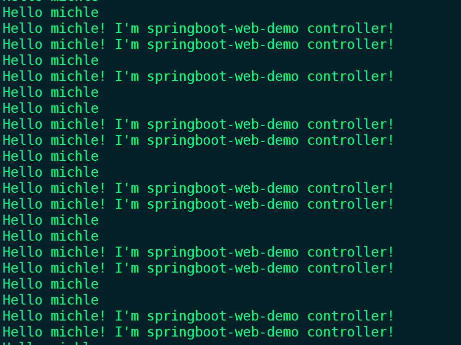
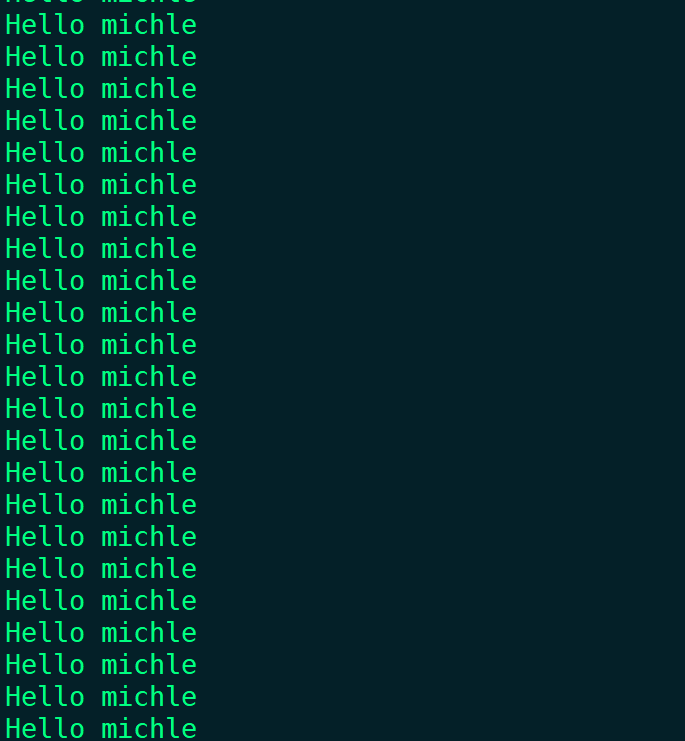
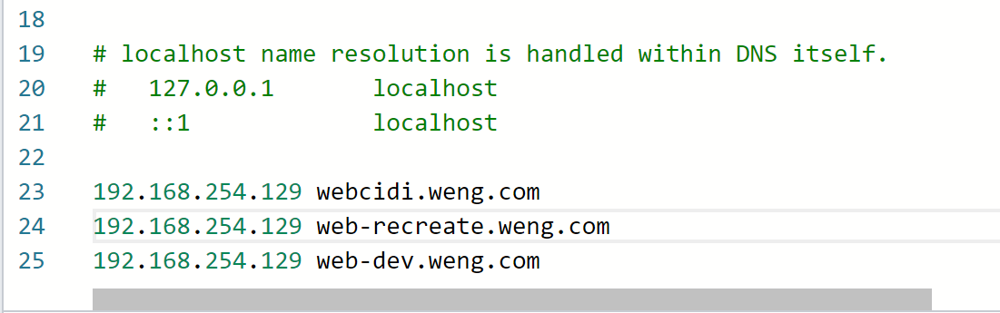
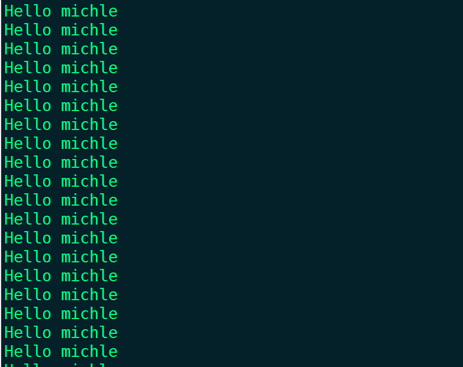
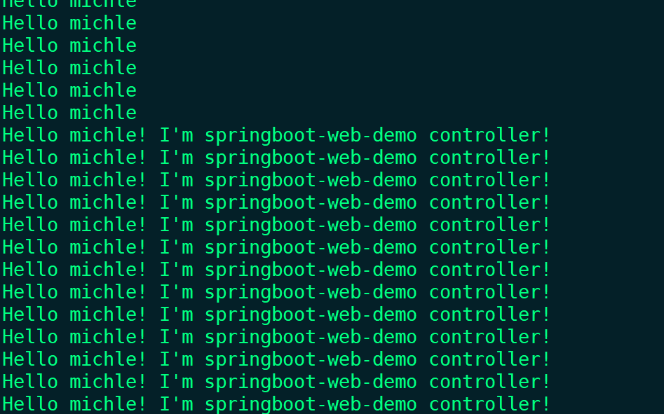
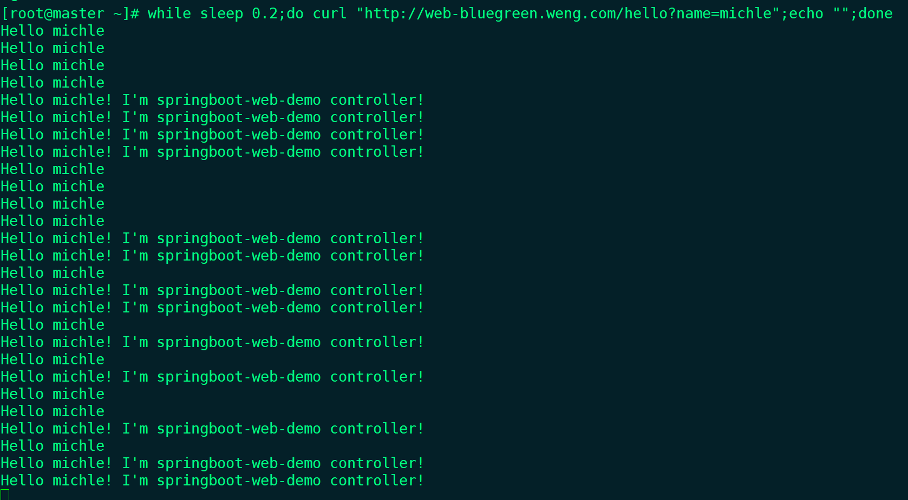

### rolling update(kubernetes支持的)

更新服务，修改yaml文件，kubectl apply -f web-rollingupdate.yaml.yaml

```
#deploy
apiVersion: apps/v1
kind: Deployment
metadata:
  name: web-rollingupdate
  namespace: dev
spec:
  strategy:
    rollingUpdate:
    #超出服务实例数的最大百分比，4个实例，每次最多多启动一个实例
      maxSurge: 25%
     #4个实例，3个实例必须是可用状态
      maxUnavailable: 25%
    type: RollingUpdate
  selector:
    matchLabels:
      app: web-rollingupdate
  replicas: 2
  template:
    metadata:
      labels:
        app: web-rollingupdate
    spec:
      containers:
      - name: web-rollingupdate
        image: 192.168.254.131/k8s/web:v1
        ports:
        - containerPort: 8080
        livenessProbe:
          tcpSocket:
            port: 8080
            #等待容器启动10秒后才执行上面的命令
          initialDelaySeconds: 20
          #每隔10秒检查一次
          periodSeconds: 10
          #健康检查的命令连续执行失败2次认为健康检查失败
          failureThreshold: 2
          #成功一次就认为健康检查成功
          successThreshold: 1
          #执行命令的等待时间，超过5秒也认为检查失败
          timeoutSeconds: 5
        readinessProbe:
         tcpSocket:
            port: 8080
            #等待容器启动10秒后才执行上面的命令
          initialDelaySeconds: 20
          #每隔10秒检查一次
          periodSeconds: 10
          #健康检查的命令连续执行失败2次认为健康检查失败
          failureThreshold: 2
          #成功一次就认为健康检查成功
          successThreshold: 1
          #执行命令的等待时间，超过5秒也认为检查失败
          timeoutSeconds: 5
---
#service
apiVersion: v1
kind: Service
metadata:
  name: web-rollingupdate
  namespace: dev
spec:
  ports:
  - port: 80
    protocol: TCP
    targetPort: 8080
  selector:
    app: web-rollingupdate
  type: ClusterIP

---
#ingress
apiVersion: extensions/v1beta1
kind: Ingress
metadata:
  name: web-rollingupdate
  namespace: dev
spec:
  rules:
    - host: web-rollingupdate.weng.com
      http:
        paths:
          - path: /
            backend:
              serviceName: web-rollingupdate
              servicePort: 80
```

查看默认名称空间下的deployment，kubectl get deploy dubbo-demo -o yaml，发现有个默认的配置就是滚动更新



浏览器访问是正常的



修改yaml文件，修改镜像，模拟升级

```
    spec:
      containers:
      - name: web-rollingupdate
        image: 192.168.254.131/k8s/springboot-web:v1
        ports:
        - containerPort: 8080
```

[root@master ~]# kubectl apply -f web-rollingupdate.yaml

```
[root@master ~]# kubectl get pods -o wide -n dev
NAME                                 READY   STATUS    RESTARTS   AGE     IP            NODE    NOMINATED NODE   READINESS GATES
web-demo-cb6ccfbbc-z685v             1/1     Running   3          6d3h    10.244.2.73   node2   <none>           <none>
web-demo-new-6488946f94-dqn8v        1/1     Running   2          6d23h   10.244.1.81   node1   <none>           <none>
web-rollingupdate-5c8677d457-9j8mx   1/1     Running   0          6m57s   10.244.2.78   node2   <none>           <none>
web-rollingupdate-5c8677d457-cknpl   1/1     Running   0          6m57s   10.244.2.77   node2   <none>           <none>
web-rollingupdate-648558c465-46t9f   0/1     Running   0          23s     10.244.2.79   node2   <none>           <none>
[root@master ~]# 
```

开启多一个终端，执行命令，查看升级过程

[root@master ~]# while sleep 0.2;do curl "http://web-rollingupdate.weng.com/hello?name=michle";echo "";done 

```
[root@master ~]# kubectl get pods -o wide  -n dev
NAME                                 READY   STATUS        RESTARTS   AGE    IP            NODE    NOMINATED NODE   READINESS GATES
web-demo-cb6ccfbbc-z685v             1/1     Running       3          6d3h   10.244.2.73   node2   <none>           <none>
web-rollingupdate-5655c9556d-jdkdq   0/1     Running       0          5s     10.244.1.87   node1   <none>           <none>
web-rollingupdate-5655c9556d-qn52j   1/1     Running       0          30s    10.244.1.86   node1   <none>           <none>
web-rollingupdate-68668446fb-b7j8s   1/1     Terminating   0          94s    10.244.2.91   node2   <none>           <none>
web-rollingupdate-68668446fb-htznq   1/1     Running       0          117s   10.244.2.90   node2   <none>           <none>
[root@master ~]# 
```

先启动一个新实例，正常运行后，退出老的，再启动一个新的，正常运行后，再退出老的，直到2个都是新的服务，可以看出服务不会中断，新老服务交替访问，是滚动更新的特征



把镜像改回去

```yaml
    spec:
      containers:
      - name: web-rollingupdate
        image: 192.168.254.131/k8s/web:v1
        ports:
        - containerPort: 8080
```

暂停升级，一个新版本，一个旧版本，

```shell
[root@master ~]# kubectl rollout  pause deploy web-rollingupdate -n dev
deployment.apps/web-rollingupdate paused
```



恢复，2个都是新服务

```shell
kubectl rollout  resume deploy web-rollingupdate -n dev
```



回退到上一个版本，也是根据比例来，先启动一个新的，再退出原来的

kubectl rollout  undo deploy web-rollingupdate -n dev

```shell
[root@master ~]# kubectl get pods -o wide  -n dev
NAME                                 READY   STATUS        RESTARTS   AGE     IP            NODE    NOMINATED NODE   READINESS GATES
web-demo-cb6ccfbbc-z685v             1/1     Running       4          6d20h   10.244.2.96   node2   <none>           <none>
web-rollingupdate-5655c9556d-cxtwb   1/1     Running       0          49s     10.244.1.93   node1   <none>           <none>
web-rollingupdate-5655c9556d-xfvnm   0/1     Running       0          22s     10.244.2.99   node2   <none>           <none>
web-rollingupdate-68668446fb-db26x   1/1     Terminating   0          10m     10.244.1.91   node1   <none>           <none>
web-rollingupdate-68668446fb-t9xhd   1/1     Running       0          10m     10.244.2.98   node2   <none>           <none>
```

回退到指定版本

```shell
kubectl rollout undo deployment/nginx-test --to-revision=2
```

查看deployment的记录

```shell
[root@master ~]# kubectl rollout history deploy -n dev
deployment.apps/web-demo 
REVISION  CHANGE-CAUSE
3         <none>
4         <none>
5         <none>
6         <none>
7         <none>
8         <none>
deployment.apps/web-rollingupdate 
REVISION  CHANGE-CAUSE
5         <none>
6         <none>
```

### recreate(kubernetes支持的)

web-recreate.yaml

```yaml
#deploy
apiVersion: apps/v1
kind: Deployment
metadata:
  name: web-recreate
  namespace: dev
spec:
  strategy:
    type: Recreate 
  selector:
    matchLabels:
      app: web-recreate
  replicas: 1
  template:
    metadata:
      labels:
        app: web-recreate
    spec:
      containers:
      - name: web-recreate
        image: 192.168.254.131/k8s/web:v1
        ports:
        - containerPort: 8080
        livenessProbe:
          tcpSocket:
            port: 8080
            #等待容器启动10秒后才执行上面的命令
          initialDelaySeconds: 20
          #每隔10秒检查一次
          periodSeconds: 10
          #健康检查的命令连续执行失败2次认为健康检查失败
          failureThreshold: 2
          #成功一次就认为健康检查成功
          successThreshold: 1
          #执行命令的等待时间，超过5秒也认为检查失败
          timeoutSeconds: 5
        readinessProbe:
          httpGet:
          #访问状态码不是200都认为健康检查失败
            path: /examples/index.html
            port: 8080
            scheme: HTTP
            #等待容器启动10秒后才执行上面的命令
          initialDelaySeconds: 20
          #每隔10秒检查一次
          periodSeconds: 10
          #健康检查的命令连续执行失败2次认为健康检查失败
          failureThreshold: 2
          #成功一次就认为健康检查成功
          successThreshold: 1
          #执行命令的等待时间，超过5秒也认为检查失败
          timeoutSeconds: 5
---
#service
apiVersion: v1
kind: Service
metadata:
  name: web-recreate
  namespace: dev
spec:
  ports:
  - port: 80
    protocol: TCP
    targetPort: 8080
  selector:
    app: web-recreate
  type: ClusterIP

---
#ingress
apiVersion: extensions/v1beta1
kind: Ingress
metadata:
  name: web-recreate
  namespace: dev
spec:
  rules:
    - host: web-recreate.weng.com
      http:
        paths:
          - path: /
            backend:
              serviceName: web-recreate
              servicePort: 80
```

[root@master ~]# kubectl get pods -o wide -n dev

```shell
NAME                            READY   STATUS    RESTARTS   AGE     IP            NODE    NOMINATED NODE   READINESS GATES
web-demo-cb6ccfbbc-z685v        1/1     Running   3          6d1h    10.244.2.73   node2   <none>           <none>
web-demo-new-6488946f94-dqn8v   1/1     Running   2          6d22h   10.244.1.81   node1   <none>           <none>
web-recreate-796ddcc879-k99bs   1/1     Running   0          26s     10.244.2.75   node2   <none>           <none>
[root@master ~]# 
```

修改hosts文件，浏览器访问




修改yaml文件，加一个lablel，

```yaml
  template:
    metadata:
      labels:
        app: web-recreate
        type: webapp
```

[root@master ~]# kubectl apply -f web-recreate.yaml 

可以看到是先停止，再重新创建，会造成服务中断

```shell
[root@master ~]# kubectl get pods -o wide -n dev
NAME                            READY   STATUS        RESTARTS   AGE     IP            NODE    NOMINATED NODE   READINESS GATES
web-demo-cb6ccfbbc-z685v        1/1     Running       3          6d2h    10.244.2.73   node2   <none>           <none>
web-demo-new-6488946f94-dqn8v   1/1     Running       2          6d22h   10.244.1.81   node1   <none>           <none>
web-recreate-796ddcc879-k99bs   1/1     Terminating   0          14m     10.244.2.75   node2   <none>           <none>
[root@master ~]#
```

### 蓝绿部署(利用service的一些特征selector机制结合deployment实现)

web-bluegreen.yaml

```
#deploy
apiVersion: apps/v1
kind: Deployment
metadata:
  name: web-bluegreen
  namespace: dev
spec:
  strategy:
    rollingUpdate:
    #超出服务实例数的最大百分比，4个实例，每次最多多启动一个实例
      maxSurge: 25%
     #4个实例，3个实例必须是可用状态
      maxUnavailable: 25%
    type: RollingUpdate
  selector:
    matchLabels:
      app: web-bluegreen
  replicas: 2
  template:
    metadata:
      labels:
        app: web-bluegreen
        version: v1.0
    spec:
      containers:
      - name: web-bluegreen
        image: 192.168.254.131/k8s/web:v1
        ports:
        - containerPort: 8080
        livenessProbe:
          tcpSocket:
            port: 8080
            #等待容器启动10秒后才执行上面的命令
          initialDelaySeconds: 20
          #每隔10秒检查一次
          periodSeconds: 10
          #健康检查的命令连续执行失败2次认为健康检查失败
          failureThreshold: 2
          #成功一次就认为健康检查成功
          successThreshold: 1
          #执行命令的等待时间，超过5秒也认为检查失败
          timeoutSeconds: 5
        readinessProbe:
          tcpSocket:
            port: 8080
            #等待容器启动10秒后才执行上面的命令
          initialDelaySeconds: 20
          #每隔10秒检查一次
          periodSeconds: 10
          #健康检查的命令连续执行失败2次认为健康检查失败
          failureThreshold: 2
          #成功一次就认为健康检查成功
          successThreshold: 1
          #执行命令的等待时间，超过5秒也认为检查失败
          timeoutSeconds: 5
```

bluegreen-service.yaml

```
---
#service
apiVersion: v1
kind: Service
metadata:
  name: web-bluegreen
  namespace: dev
spec:
  ports:
  - port: 80
    protocol: TCP
    targetPort: 8080
  selector:
    app: web-bluegreen
    version: v1.0
  type: ClusterIP

---
#ingress
apiVersion: extensions/v1beta1
kind: Ingress
metadata:
  name: web-bluegreen
  namespace: dev
spec:
  rules:
    - host: web-bluegreen.weng.com
      http:
        paths:
          - path: /
            backend:
              serviceName: web-bluegreen
              servicePort: 80
```


```shell
[root@master ~]# kubectl apply -f web-bluegreen.yaml 
deployment.apps/web-bluegreen created
[root@master ~]# kubectl apply -f bluegreen-service.yaml 
service/web-bluegreen created
ingress.extensions/web-bluegreen created
[root@master ~]# kubectl get pods -o wide  -n dev
NAME                             READY   STATUS    RESTARTS   AGE     IP             NODE    NOMINATED NODE   READINESS GATES
web-bluegreen-7d89b6f5f5-8r6lc   1/1     Running   0          83s     10.244.1.95    node1   <none>           <none>
web-bluegreen-7d89b6f5f5-gxv6c   1/1     Running   0          83s     10.244.2.101   node2   <none>           <none>
web-demo-cb6ccfbbc-z685v         1/1     Running   4          6d21h   10.244.2.96    node2   <none>           <none>
[root@master ~]# 
```

while sleep 0.2;do curl "http://web-bluegreen.weng.com/hello?name=michle";echo "";done  循环访问



修改deployment 的yaml文件，镜像，deployment名字，label版本号

```
#deploy
apiVersion: apps/v1
kind: Deployment
metadata:
  name: web-bluegreen-v2
  namespace: dev
spec:
  strategy:
    rollingUpdate:
    #超出服务实例数的最大百分比，4个实例，每次最多多启动一个实例
      maxSurge: 25%
     #4个实例，3个实例必须是可用状态
      maxUnavailable: 25%
    type: RollingUpdate
  selector:
    matchLabels:
      app: web-bluegreen
  replicas: 2
  template:
    metadata:
      labels:
        app: web-bluegreen
        version: v2.0
    spec:
      containers:
      - name: web-bluegreen
        image: 192.168.254.131/k8s/springboot-web:v1
        ports:
        - containerPort: 8080
        livenessProbe:
          tcpSocket:
            port: 8080
            #等待容器启动10秒后才执行上面的命令
          initialDelaySeconds: 20
          #每隔10秒检查一次
          periodSeconds: 10
          #健康检查的命令连续执行失败2次认为健康检查失败
          failureThreshold: 2
          #成功一次就认为健康检查成功
          successThreshold: 1
          #执行命令的等待时间，超过5秒也认为检查失败
          timeoutSeconds: 5
        readinessProbe:
          tcpSocket:
            port: 8080
            #等待容器启动10秒后才执行上面的命令
          initialDelaySeconds: 20
          #每隔10秒检查一次
          periodSeconds: 10
          #健康检查的命令连续执行失败2次认为健康检查失败
          failureThreshold: 2
          #成功一次就认为健康检查成功
          successThreshold: 1
          #执行命令的等待时间，超过5秒也认为检查失败
          timeoutSeconds: 5
```

可以看到有2个版本的deployment在运行

```shell
[root@master ~]# kubectl apply -f web-bluegreen.yaml 
deployment.apps/web-bluegreen-v2 created
[root@master ~]# kubectl get pods -o wide  -n dev
NAME                               READY   STATUS              RESTARTS   AGE     IP             NODE    NOMINATED NODE   READINESS GATES
web-bluegreen-7d89b6f5f5-8r6lc     1/1     Running             0          6m39s   10.244.1.95    node1   <none>           <none>
web-bluegreen-7d89b6f5f5-gxv6c     1/1     Running             0          6m39s   10.244.2.101   node2   <none>           <none>
web-bluegreen-v2-865bbc974-qsp8d   0/1     ContainerCreating   0          1s      <none>         node2   <none>           <none>
web-bluegreen-v2-865bbc974-r87jw   0/1     Running             0          1s      10.244.1.96    node1   <none>           <none>
web-demo-cb6ccfbbc-z685v           1/1     Running  
```

把bluegreen-service.yaml  的version修改为v2.0

```
---
#service
apiVersion: v1
kind: Service
metadata:
  name: web-bluegreen
  namespace: dev
spec:
  ports:
  - port: 80
    protocol: TCP
    targetPort: 8080
  selector:
    app: web-bluegreen
    version: v2.0
  type: ClusterIP

---
#ingress
apiVersion: extensions/v1beta1
kind: Ingress
metadata:
  name: web-bluegreen
  namespace: dev
spec:
  rules:
    - host: web-bluegreen.weng.com
      http:
        paths:
          - path: /
            backend:
              serviceName: web-bluegreen
              servicePort: 80
```

可以以看到流量都切到v2.0的服务上了

```shell
[root@master ~]# vim bluegreen-service.yaml 
[root@master ~]# kubectl apply -f bluegreen-service.yaml 
service/web-bluegreen configured
ingress.extensions/web-bluegreen configured
[root@master ~]# kubectl get pods -o wide  -n dev
NAME                               READY   STATUS    RESTARTS   AGE     IP             NODE    NOMINATED NODE   READINESS GATES
web-bluegreen-7d89b6f5f5-8r6lc     1/1     Running   0          9m43s   10.244.1.95    node1   <none>           <none>
web-bluegreen-7d89b6f5f5-gxv6c     1/1     Running   0          9m43s   10.244.2.101   node2   <none>           <none>
web-bluegreen-v2-865bbc974-qsp8d   1/1     Running   0          3m5s    10.244.2.102   node2   <none>           <none>
web-bluegreen-v2-865bbc974-r87jw   1/1     Running   0          3m5s    10.244.1.96    node1   <none>           <none>
web-demo-cb6ccfbbc-z685v           1/1     Running   4          6d21h   10.244.2.96    node2   <none>           <none>
```



### 金丝雀(利用service的一些特征selector机制结合deployment实现)

在上面的基础上，修改bluegreen-service.yaml ，把version字段去掉

```
---
#service
apiVersion: v1
kind: Service
metadata:
  name: web-bluegreen
  namespace: dev
spec:
  ports:
  - port: 80
    protocol: TCP
    targetPort: 8080
  selector:
    app: web-bluegreen
  type: ClusterIP

---
#ingress
apiVersion: extensions/v1beta1
kind: Ingress
metadata:
  name: web-bluegreen
  namespace: dev
spec:
  rules:
    - host: web-bluegreen.weng.com
      http:
        paths:
          - path: /
            backend:
              serviceName: web-bluegreen
              servicePort: 80
```

四个pod都会被访问，新旧版本交替访问

```shell
[root@master ~]# kubectl apply -f bluegreen-service.yaml 
service/web-bluegreen configured
ingress.extensions/web-bluegreen configured
[root@master ~]# kubectl get pods -o wide  -n dev
NAME                               READY   STATUS    RESTARTS   AGE     IP             NODE    NOMINATED NODE   READINESS GATES
web-bluegreen-7d89b6f5f5-8r6lc     1/1     Running   0          16m     10.244.1.95    node1   <none>           <none>
web-bluegreen-7d89b6f5f5-gxv6c     1/1     Running   0          16m     10.244.2.101   node2   <none>           <none>
web-bluegreen-v2-865bbc974-qsp8d   1/1     Running   0          9m48s   10.244.2.102   node2   <none>           <none>
web-bluegreen-v2-865bbc974-r87jw   1/1     Running   0          9m48s   10.244.1.96    node1   <none>           <none>
web-demo-cb6ccfbbc-z685v           1/1     Running   4          6d21h   10.244.2.96    node2   <none>           <none>
```



