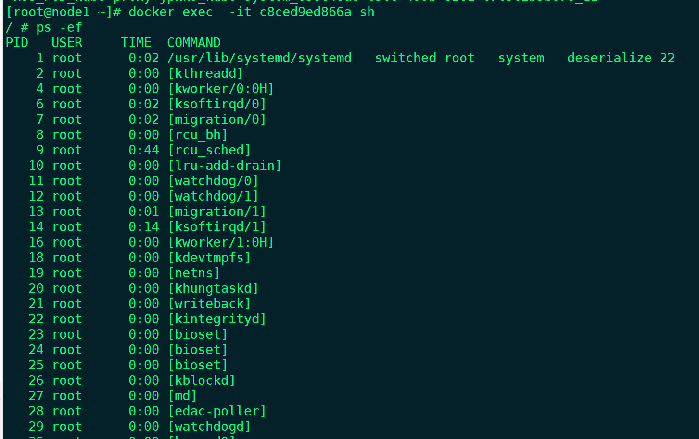
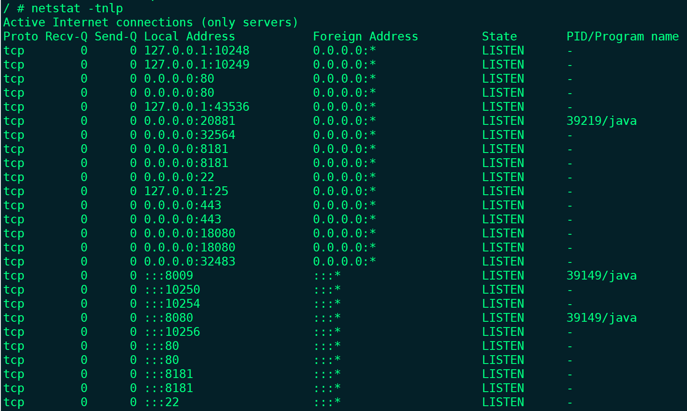
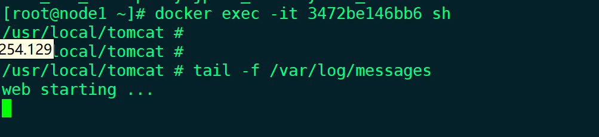
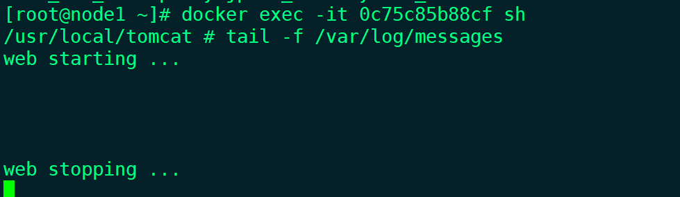
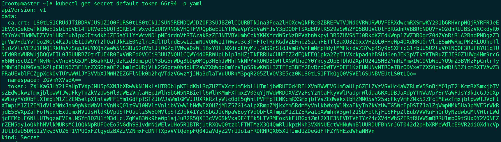
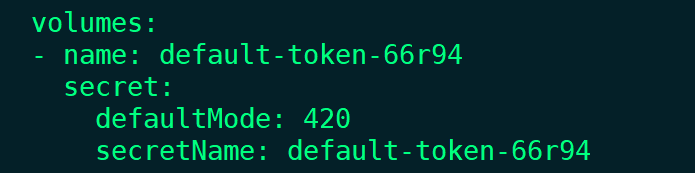
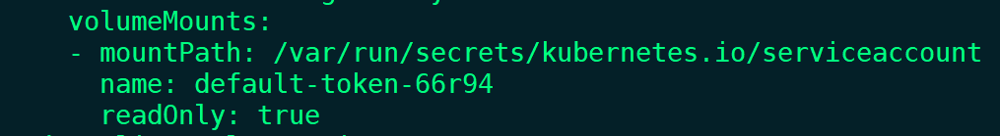
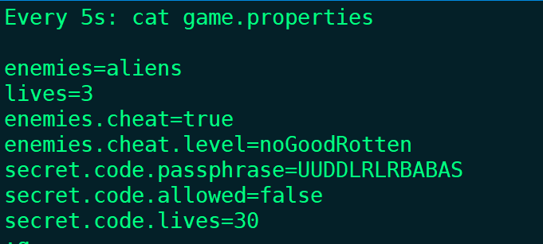
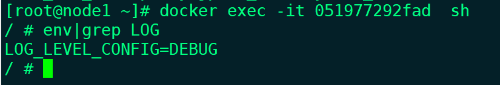
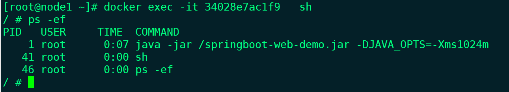

pod内的容器共享网络

pod-network.yaml

```
apiVersion: v1
kind: Pod
metadata:
  name: pod-network
  namespace: dev
spec:
  containers:
  - name: web
    image: 192.168.254.131/k8s/web:v1
    ports:
    - containerPort: 8080
  - name: dubbo
    env:
    - name: DUBBO_PORT
      value: "20881"
    image: 192.168.254.131/k8s/dubbo:v1
    ports:
    - containerPort: 20881
      hostPort: 20881
      protocol: TCP
     
```


```shell
[root@master ~]# kubectl create -f pod-network.yaml 
pod/pod-network created
[root@master ~]# kubectl get pods -o wide  -n dev
NAME                       READY   STATUS    RESTARTS   AGE    IP            NODE    NOMINATED NODE   READINESS GATES
pod-network                2/2     Running   0          8s     10.244.1.97   node1   <none>           <none>
web-demo-cb6ccfbbc-z685v   1/1     Running   4          7d2h   10.244.2.96   node2   <none>           <none>
```

去node1节点进入dubbo容器查看端口监听情况，也能看得到tomcat的端口

```
[root@node1 ~]# docker exec -it 14217500d625 sh
/ # netstat -tnlp
Active Internet connections (only servers)
Proto Recv-Q Send-Q Local Address           Foreign Address         State       PID/Program name    
tcp        0      0 127.0.0.1:8005          0.0.0.0:*               LISTEN      -
tcp        0      0 0.0.0.0:20881           0.0.0.0:*               LISTEN      26/java
tcp        0      0 :::8009                 :::*                    LISTEN      -
tcp        0      0 :::8080                 :::*                    LISTEN      -
/ # ps -ef
PID   USER     TIME  COMMAND
    1 root      0:00 sh /ROOT/bin/start.sh
   26 root      0:02 /usr/lib/jvm/java-1.8-openjdk/jre/bin/java -Dapp.name=demo -Djava.awt.headless=true -Djava.net.preferIPv4Stack=true -classpath /ROOT/c
   49 root      0:00 sh
   55 root      0:00 ps -ef
/ # 
```

说明在dubbo容器里可以访问到tomcat容器，pod的容器是共享网络的

```
/ # wget localhost:8080
Connecting to localhost:8080 (127.0.0.1:8080)
wget: server returned error: HTTP/1.1 404 Not Found
/ # 
```

进入tomcat容器，查看ip，网络设备都和dubbo容器的一致

```shell
/ # ifconfig
eth0      Link encap:Ethernet  HWaddr CA:4C:B2:F2:62:30  
          inet addr:10.244.1.97  Bcast:10.244.1.255  Mask:255.255.255.0
          UP BROADCAST RUNNING MULTICAST  MTU:1450  Metric:1
          RX packets:272 errors:0 dropped:0 overruns:0 frame:0
          TX packets:428 errors:0 dropped:0 overruns:0 carrier:0
          collisions:0 txqueuelen:0 
          RX bytes:23651 (23.0 KiB)  TX bytes:32149 (31.3 KiB)

lo        Link encap:Local Loopback  
          inet addr:127.0.0.1  Mask:255.0.0.0
          UP LOOPBACK RUNNING  MTU:65536  Metric:1
          RX packets:61 errors:0 dropped:0 overruns:0 frame:0
          TX packets:61 errors:0 dropped:0 overruns:0 carrier:0
          collisions:0 txqueuelen:1000 
          RX bytes:4974 (4.8 KiB)  TX bytes:4974 (4.8 KiB)

/ # ip add
1: lo: <LOOPBACK,UP,LOWER_UP> mtu 65536 qdisc noqueue state UNKNOWN qlen 1000
    link/loopback 00:00:00:00:00:00 brd 00:00:00:00:00:00
    inet 127.0.0.1/8 scope host lo
       valid_lft forever preferred_lft forever
3: eth0@if15: <BROADCAST,MULTICAST,UP,LOWER_UP,M-DOWN> mtu 1450 qdisc noqueue state UP 
    link/ether ca:4c:b2:f2:62:30 brd ff:ff:ff:ff:ff:ff
    inet 10.244.1.97/24 brd 10.244.1.255 scope global eth0
       valid_lft forever preferred_lft forever
/ #
```

共享存储

pod-volume.yaml

```
apiVersion: v1
kind: Pod
metadata:
  name: pod-volume
  namespace: dev
spec:
  containers:
  - name: web
    image: 192.168.254.131/k8s/web:v1
    ports:
    - containerPort: 8080
    volumeMounts:
    - name: shared-volume
      mountPath: /shared-web
  - name: dubbo
    env:
    - name: DUBBO_PORT
      value: "20881"
    image: 192.168.254.131/k8s/dubbo:v1
    ports:
    - containerPort: 20881
      hostPort: 20881
      protocol: TCP
    volumeMounts:
    - name: shared-volume
      mountPath: /shared-dubbo
  #pod层面的定义，所有pod里面的容器都可以使用volumes
  volumes:
  - name: shared-volume
    hostPath:
      path: /shared-volume-data
```

[root@master ~]# kubectl apply -f  pod-volume.yaml 

```
pod/pod-volume created
[root@master ~]# kubectl get pods -o wide  -n dev
NAME                       READY   STATUS    RESTARTS   AGE    IP            NODE    NOMINATED NODE   READINESS GATES
pod-volume                 2/2     Running   0          2s     10.244.1.98   node1   <none>           <none>
web-demo-cb6ccfbbc-z685v   1/1     Running   4          7d3h   10.244.2.96   node2   <none>           <none>
```

node1节点进入dubbo容器查看，进入/shared-dubbo 目录创建文件abc

```
[root@node1 ~]# docker exec -it 6acd193b8e7b sh
/ # cd /shared-dubbo/
/shared-dubbo # touch abc
/shared-dubbo # ls
abc
```

进入tomcat容器查看也存在这个文件

```
[root@node1 ~]# docker exec -it bf9672907754  sh
/usr/local/tomcat # cd /shared-web/
/shared-web # ls
abc
/shared-web # 
```

2个容器的/etc/hosts文件也是一样的，由pod管理的，

加入以下配置，先删除之前创建的pod

```
spec:
  hostAliases:
  - ip: "192.168.254.129"
    hostnames:
    - "web.weng.com"
```

node1上进入容器查看，/etc/hosts加入配置成功，2个容器都一样

```
[root@node1 ~]# docker exec -it 72b263a8d9cf  cat /etc/hosts
# Kubernetes-managed hosts file.
127.0.0.1	localhost
::1	localhost ip6-localhost ip6-loopback
fe00::0	ip6-localnet
fe00::0	ip6-mcastprefix
fe00::1	ip6-allnodes
fe00::2	ip6-allrouters
10.244.1.100	pod-volume

# Entries added by HostAliases.
192.168.254.129	web.weng.com
[root@node1 ~]#
```

添加配置，删除之前创建的[root@master ~]# kubectl delete -f pod-volume.yaml

```
spec:
  hostNetwork: true
  #使用宿主机的pid namespace
  hostPID: true
```

[root@master ~]# kubectl apply -f pod-volume.yaml

进入容器查看进程，有很多系统进程，因为使用了宿主机的进程空间



也使用了宿主机的网络空间



生命周期

修改yaml文件，

容器启动后执行命令，执行entrypoint命令进行启动的时候会同时执行这个exec command，并行的，同时进行

停止之前要做的事，串行的，停止之前会执行这个命令，等这个命令执行完后才会给容器发送停止信号，如果命令执行时间太长，有个超时时间，超过会跳过

因为执行命令很快，睡眠3秒

```
  containers:
  - name: web
    image: 192.168.254.131/k8s/web:v1
    ports:
    - containerPort: 8080
    volumeMounts:
    - name: shared-volume
      mountPath: /shared-web
    lifecycle:
      postStart:
        exec:
          command:  ["/bin/bash","-c","echo web starting ... >> /var/log/messages"]
      preStop:
        exec:
          command:  ["/bin/bash","-c","echo web stopping ... >> /var/log/messages && sleep 3"]
```

进入tomcat容器查看



删除容器，[root@master ~]# kubectl delete -f pod-volume.yaml 


生命周期

Pendding  内存不足，匹配不到满足要求的节点，拉取镜像

containerCreating 创建容器状态

Running 运行中

Succeeded 成功运行   job,cronjob类型才有，退出值是0

Failed 失败退出 job，cronjob类型才有

Ready 配置了健康检查并且通过了

CrashLoopBackOff   配置了健康检查并且没有通过，启动失败状态

Unknown  apiserver没有收到pod相关信息的汇报，一般是kubelet和apiserver通讯有问题

**轻量级Volume，ProjectedVolume，三种使用场景，Secret ConfigMap DownloadAPI**

`Secret`

查看secret

```
[root@master ~]# kubectl get secret
NAME                  TYPE                                  DATA   AGE
default-token-66r94   kubernetes.io/service-account-token   3      18d
```



kubernetes会自动把service-account加入到每个pod，

```
[root@master ~]# kubectl get  pods
NAME                          READY   STATUS    RESTARTS   AGE
dubbo-demo-5c6fc66f47-j9kmj   1/1     Running   1          4d
[root@master ~]# kubectl get  pods dubbo-demo-5c6fc66f47-j9kmj -o yaml
```





进入容器目录，/var/run/secrets/kubernetes.io/serviceaccount，查看

```
[root@node2 ~]# docker exec -it 81a950e014db sh
/ # cd /var/run/secrets/kubernetes.io/serviceaccount
/run/secrets/kubernetes.io/serviceaccount # ls -l
total 0
lrwxrwxrwx    1 root     root            13 Jun  1 02:53 ca.crt -> ..data/ca.crt
lrwxrwxrwx    1 root     root            16 Jun  1 02:53 namespace -> ..data/namespace
lrwxrwxrwx    1 root     root            12 Jun  1 02:53 token -> ..data/token
```

secret.yaml，写到etcd里

```
apiVersion: v1
kind: Secret
metadata:
  name: dbpass
type: Opaque
data:
  username: YWJjZA==
  passwd: YWJjZGU=
```

pod-secret.yaml

```
apiVersion: v1
kind: Pod
metadata:
  name: pod-secret
spec:
  containers:
  - name: springboot-web
    image: 192.168.254.131/k8s/springboot-web:v1
    ports:
    - containerPort: 8080
    volumeMounts:
    - name: db-secret
      mountPath: /db-secret
      readOnly: true
  volumes:
  - name: db-secret
    projected:
      sources:
      - secret:
          name: dbpass
```

进入node1上的容器，可以看到挂载的目录

```
[root@master ~]# kubectl apply -f pod-secrets.yaml 
pod/pod-secret created
[root@master ~]# kubectl get pods -o wide
NAME                          READY   STATUS    RESTARTS   AGE    IP                NODE    NOMINATED NODE   READINESS GATES
dubbo-demo-5c6fc66f47-j9kmj   1/1     Running   1          4d2h   192.168.254.130   node2   <none>           <none>
pod-secret                    1/1     Running   0          24s    10.244.1.101      node1   <none>           <none>
[root@master ~]# 
```

```
[root@node1 ~]# docker exec -it 05146416d975 sh
/ # cd /db-secret/
/db-secret # ls
passwd    username
/db-secret # cat -n passwd 
     1	abcde
/db-secret # cat -n username  
     1	abcd
/db-secret #
```

修改secret.yaml，修改密码和用户名一致

kubectl apply -f secret.yaml，更改会马上生效

`ConfigMap`  存储不需要加密的数据，参数配置等

1、 配置文件使用configmap

```
[root@master ~]# cat game.properties 
enemies=aliens
lives=3
enemies.cheat=true
enemies.cheat.level=noGoodRotten
secret.code.passphrase=UUDDLRLRBABAS
secret.code.allowed=true
secret.code.lives=30
[root@master ~]# 
```

根据文件创建configmap

```
[root@master ~]# kubectl create configmap web-game --from-file game.properties 
configmap/web-game created
[root@master ~]#
```

查看

```
[root@master ~]# kubectl get cm web-game -o yaml
apiVersion: v1
data:
  game.properties: |
    enemies=aliens
    lives=3
    enemies.cheat=true
    enemies.cheat.level=noGoodRotten
    secret.code.passphrase=UUDDLRLRBABAS
    secret.code.allowed=true
    secret.code.lives=30
kind: ConfigMap
metadata:
  creationTimestamp: "2021-06-05T07:09:02Z"
  managedFields:
  - apiVersion: v1
    fieldsType: FieldsV1
    fieldsV1:
      f:data:
        .: {}
        f:game.properties: {}
    manager: kubectl
    operation: Update
    time: "2021-06-05T07:09:02Z"
  name: web-game
  namespace: default
  resourceVersion: "883437"
  selfLink: /api/v1/namespaces/default/configmaps/web-game
  uid: 8f1f5335-da92-4f32-b3c8-55d6a4596482
[root@master ~]#
```

pod使用configmap，直接覆盖目录，不会单独替换目录的某个文件

```
apiVersion: v1
kind: Pod
metadata:
  name: pod-game
spec:
  containers:
  - name: web
    image: 192.168.254.131/k8s/springboot-web:v1
    ports:
    - containerPort: 8080
    volumeMounts:
    - name: game
      mountPath: /etc/config/game
      readOnly: true
  volumes:
  - name: game
    configMap:
      name: web-game 
```

[root@master ~]# kubectl apply -f pod-game.yaml
pod/pod-game created

进入node1节点的容器查看

```
[root@node1 ~]# docker exec -it 65325d728ea1 sh
/ # cd /etc/config/game/
/etc/config/game # cat -n game.properties 
     1	enemies=aliens
     2	lives=3
     3	enemies.cheat=true
     4	enemies.cheat.level=noGoodRotten
     5	secret.code.passphrase=UUDDLRLRBABAS
     6	secret.code.allowed=true
     7	secret.code.lives=30
/etc/config/game #
```

修改配置，secret.code.allowed=false，很快生效，不需要重启

```
[root@master ~]# kubectl edit cm web-game
configmap/web-game edited
[root@master ~]
```



2、 环境变量使用configMap

[root@master ~]# kubectl create -f configmap.yaml 
configmap/configs created

```
apiVersion: v1
kind: ConfigMap
metadata:
  name: configs
data:
  JAVA_OPTS: -Xms1024m
  LOG_LEVEL: DEBUG
```

POD使用

```
apiVersion: v1
kind: Pod
metadata:
  name: pod-env
spec:
  containers:
  - name: web
    image: 192.168.254.131/k8s/springboot-web:v1
    ports:
    - containerPort: 8080
    env:
      - name: LOG_LEVEL_CONFIG
        valueFrom:
          configMapKeyRef:
            name: configs
            key: LOG_LEVEL
```

[root@master ~]# kubectl create -f pod-env.yaml 
pod/pod-env created
[root@master ~]# kubectl get pods -o wide 
NAME                          READY   STATUS    RESTARTS   AGE     IP                NODE    NOMINATED NODE   READINESS GATES
dubbo-demo-5c6fc66f47-j9kmj   1/1     Running   2          4d21h   192.168.254.130   node2   <none>           <none>
pod-env                       1/1     Running   0          5s      10.244.1.105      node1   <none>           <none>
[root@master ~]# 

进入容器查看



3、命令行参数传递

```
apiVersion: v1
kind: Pod
metadata:
  name: pod-cmd
spec:
  containers:
  - name: web
    image: 192.168.254.131/k8s/springboot-web:v1
    command: ["/bin/sh","-c","java -jar /springboot-web-demo.jar -DJAVA_OPTS=$(JAVA_OPTS)"]
    ports:
    - containerPort: 8080
    env:
      - name: JAVA_OPTS
        valueFrom:
          configMapKeyRef:
            name: configs
            key: JAVA_OPTS
```

[root@master ~]# kubectl get pods -o wide 
NAME                          READY   STATUS    RESTARTS   AGE     IP                NODE    NOMINATED NODE   READINESS GATES
dubbo-demo-5c6fc66f47-j9kmj   1/1     Running   2          4d22h   192.168.254.130   node2   <none>           <none>
pod-cmd                       1/1     Running   0          8s      10.244.1.109      node1   <none>           <none>
[root@master ~]#

进入容器查看



`DownwardAPI`

在程序中可以取得pod本身的一些相关信息

```
apiVersion: v1
kind: Pod
metadata:
  name: pod-downwardapi
  labels:
    app: downwardapi
    type: webapp
spec:
  containers:
  - name: web
    image: 192.168.254.131/k8s/springboot-web:v1
    ports:
    - containerPort: 8080
    volumeMounts:
      - name: podinfo
        mountPath: /etc/podinfo
  volumes:
    - name: podinfo
      projected:
        sources:
        - downwardAPI:
            items:
              - path: "labels"
                fieldRef:
                  fieldPath: metadata.labels
              - path: "name"
                fieldRef:
                  fieldPath: metadata.name
              - path: "namespace"
                fieldRef:
                  fieldPath: metadata.namespace
              - path: "mem-request"
                resourceFieldRef:
                  containerName: web
                  resource: limits.memory
```

创建

```
[root@master ~]# kubectl create -f pod-downwardapi.yaml 
pod/pod-downwardapi created
[root@master ~]# kubectl get pods -o wide
NAME                          READY   STATUS    RESTARTS   AGE     IP                NODE    NOMINATED NODE   READINESS GATES
dubbo-demo-5c6fc66f47-j9kmj   1/1     Running   2          4d22h   192.168.254.130   node2   <none>           <none>
pod-downwardapi               1/1     Running   0          18s     10.244.1.110      node1   <none>           <none>
[root@master ~]#
```

进入容器查看

```
[root@node1 ~]# docker exec -it 6f479e820323  sh
/ # cd /etc/podinfo
/etc/podinfo # ls -l
total 0
lrwxrwxrwx    1 root     root            13 Jun  5 08:27 labels -> ..data/labels
lrwxrwxrwx    1 root     root            18 Jun  5 08:27 mem-request -> ..data/mem-request
lrwxrwxrwx    1 root     root            11 Jun  5 08:27 name -> ..data/name
lrwxrwxrwx    1 root     root            16 Jun  5 08:27 namespace -> ..data/namespace
/etc/podinfo # cat -n namespace 
     1	default
/etc/podinfo #
```

