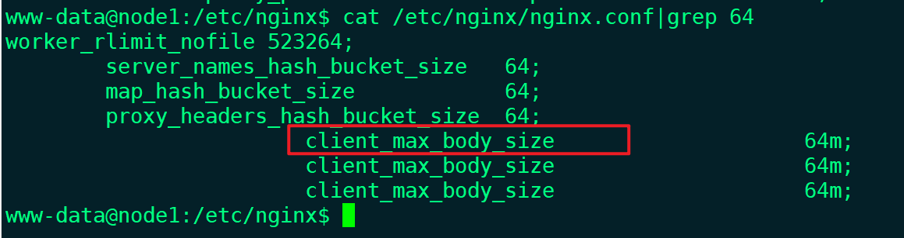
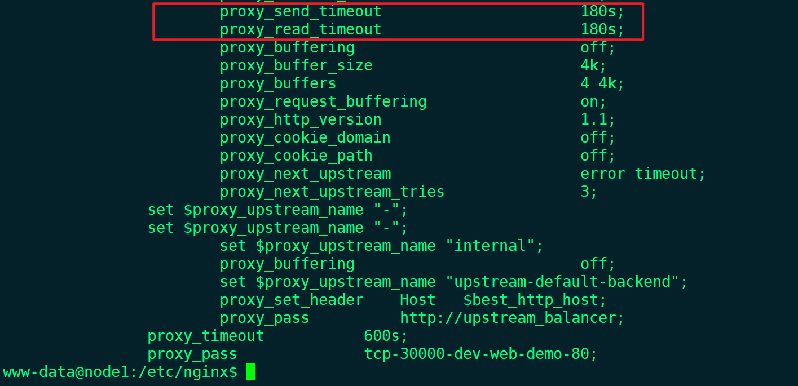
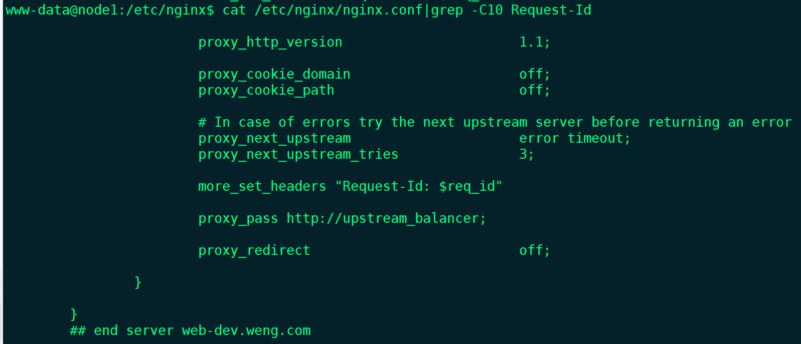
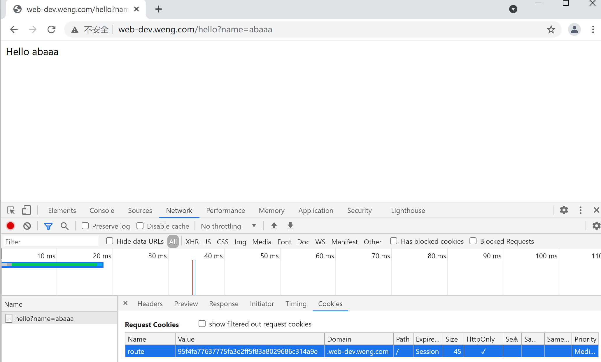
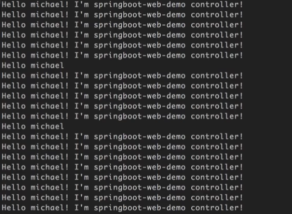

#### 修改ingress的类型为DaemonSet

```
apiVersion: apps/v1
kind: DaemonSet
metadata:
  labels:
    app.kubernetes.io/name: ingress-nginx
    app.kubernetes.io/part-of: ingress-nginx
  name: nginx-ingress-controller
  namespace: ingress-nginx
spec:
  revisionHistoryLimit: 10
  selector:
    matchLabels:
      app.kubernetes.io/name: ingress-nginx
      app.kubernetes.io/part-of: ingress-nginx
  updateStrategy:
    rollingUpdate:
      maxUnavailable: 1 
    type: RollingUpdate
  template:
    metadata:
      annotations:
        prometheus.io/port: "10254"
        prometheus.io/scrape: "true"
      creationTimestamp: null
      labels:
        app.kubernetes.io/name: ingress-nginx
        app.kubernetes.io/part-of: ingress-nginx
    spec:
      containers:
      - args:
        - /nginx-ingress-controller
        - --default-backend-service=$(POD_NAMESPACE)/default-http-backend
        - --configmap=$(POD_NAMESPACE)/nginx-configuration
        - --tcp-services-configmap=$(POD_NAMESPACE)/tcp-services
        - --udp-services-configmap=$(POD_NAMESPACE)/udp-services
        - --publish-service=$(POD_NAMESPACE)/ingress-nginx
        - --annotations-prefix=nginx.ingress.kubernetes.io
        env:
        - name: POD_NAME
          valueFrom:
            fieldRef:
              apiVersion: v1
              fieldPath: metadata.name
        - name: POD_NAMESPACE
          valueFrom:
            fieldRef:
              apiVersion: v1
              fieldPath: metadata.namespace
        image: registry.cn-qingdao.aliyuncs.com/kubernetes_xingej/nginx-ingress-controller:0.20.0
        imagePullPolicy: IfNotPresent
        livenessProbe:
          failureThreshold: 3
          httpGet:
            path: /healthz
            port: 10254
            scheme: HTTP
          initialDelaySeconds: 10
          periodSeconds: 10
          successThreshold: 1
          timeoutSeconds: 1
        name: nginx-ingress-controller
        ports:
        - containerPort: 80
          hostPort: 80
          name: http
          protocol: TCP
        - containerPort: 443
          hostPort: 443
          name: https
          protocol: TCP
        readinessProbe:
          failureThreshold: 3
          httpGet:
            path: /healthz
            port: 10254
            scheme: HTTP
          periodSeconds: 10
          successThreshold: 1
          timeoutSeconds: 1
        resources: {}
        securityContext:
          capabilities:
            add:
            - NET_BIND_SERVICE
            drop:
            - ALL
          runAsUser: 33
        terminationMessagePath: /dev/termination-log
        terminationMessagePolicy: File
      dnsPolicy: ClusterFirst
      hostNetwork: true
      nodeSelector:
        app: ingress
      restartPolicy: Always
      schedulerName: default-scheduler
      securityContext: {}
      serviceAccount: nginx-ingress-serviceaccount
      serviceAccountName: nginx-ingress-serviceaccount
      terminationGracePeriodSeconds: 30
```

查看

```
[root@master ~]# kubectl get ds -n ingress-nginx
NAME                       DESIRED   CURRENT   READY   UP-TO-DATE   AVAILABLE   NODE SELECTOR   AGE
nginx-ingress-controller   1         1         1       1            1           app=ingress     73s
[root@master ~]# kubectl get pods -n ingress-nginx
NAME                                   READY   STATUS    RESTARTS   AGE
default-http-backend-796ddcd9b-9jgz4   1/1     Running   11         19d
nginx-ingress-controller-grkgm         1/1     Running   0          90s
[root@master ~]# kubectl get pods -n ingress-nginx -o wide
NAME                                   READY   STATUS    RESTARTS   AGE   IP                NODE    NOMINATED NODE   READINESS GATES
default-http-backend-796ddcd9b-9jgz4   1/1     Running   11         19d   10.244.1.102      node1   <none>           <none>
nginx-ingress-controller-grkgm         1/1     Running   0          94s   192.168.254.129   node1   <none>           <none>
[root@master ~]#
```

访问之前部署的服务是正常的，部署成功


给node2也运行ingress-nginx，只需要打上标签

```
[root@master ~]# kubectl label  node node2 app=ingress
node/node2 labeled
[root@master ~]# kubectl get pods -n ingress-nginx -o wide
NAME                                   READY   STATUS    RESTARTS   AGE   IP                NODE    NOMINATED NODE   READINESS GATES
default-http-backend-796ddcd9b-9jgz4   1/1     Running   11         19d   10.244.1.102      node1   <none>           <none>
nginx-ingress-controller-grkgm         1/1     Running   0          14m   192.168.254.129   node1   <none>           <none>
nginx-ingress-controller-sxqgv         1/1     Running   0          54s   192.168.254.130   node2   <none>           <none>
[root@master ~]# 
```

去除标签

```
[root@master ~]# kubectl label  node node2 app-
node/node2 labeled
[root@master ~]#
```

查看configMap

```
[root@master ~]# kubectl get cm -n ingress-nginx -o wide
NAME                              DATA   AGE
ingress-controller-leader-nginx   0      19d
nginx-configuration               0      19d
tcp-services                      0      19d
udp-services                      0      19d
```

#### **ingress-nginx实现四层代理**

[root@master ~]# kubectl apply -f tcp-services.yaml
configmap/tcp-services configured
[root@master ~]# 

```
apiVersion: v1
kind: ConfigMap
metadata:
  name: tcp-services
  namespace: ingress-nginx
  #把dev/web-demo:80 服务暴露在ingress-nginx 的 30000 端口
data:
  "30000": dev/web-demo:80
```

去node1节点上看端口是否在监听

```
[root@node1 ~]# netstat -tnlp|grep 30000
tcp        0      0 0.0.0.0:30000           0.0.0.0:*               LISTEN      3531/nginx: master  
tcp6       0      0 :::30000                :::*                    LISTEN      3531/nginx: master  
[root@node1 ~]# 
```

浏览器访问正常


#### **ingress-nginx定制配置**

```url
参考 https://kubernetes.github.io/ingress-nginx/user-guide/nginx-configuration/configmap/
```

```
apiVersion: v1
kind: ConfigMap
metadata:
  name: nginx-configuration
  namespace: ingress-nginx
  labels:
    app: ingress-nginx
data:
#nginx的key直接在这里填写是不对的，需要去官网查看proxy-body-size 对应的是client_max_body_size
  proxy-body-size: "64m"
  proxy-read-timeout: "180"
  proxy-send-timeout: "180"
```

[root@master ~]# kubectl apply -f nginx-config.yml 
configmap/nginx-configuration configured

node1上进入容器查看配置，添加成功





##### **自定义全局头部headers**

```
apiVersion: v1
kind: ConfigMap
metadata:
  name: nginx-configuration
  namespace: ingress-nginx
  labels:
    app.kubernetes.io/name: ingress-nginx
    app.kubernetes.io/port-of: ingress-nginx
data:
  proxy-set-headers: "ingress-nginx/custom-headers"

---
#把这个配置文件当作headers引入进去
apiVersion: v1
kind: ConfigMap
metadata:
  name: custom-headers
  namespace: ingress-nginx
data:
  X-Different-Name: "true"
  X-Request-Start: t=${msec}
  X-Using-Nginx-Controller: "true"
```

进入容器查看

```
www-data@node1:/etc/nginx$ cat /etc/nginx/nginx.conf|grep -A 2 X-Different-Name
			proxy_set_header X-Different-Name                    "true";
		proxy_set_header X-Request-Start                    "t=${msec}";
			proxy_set_header X-Using-Nginx-Controller                    "true";
www-data@node1:/etc/nginx$
```

##### **定制某个ingress下的headers**

```
apiVersion: extensions/v1beta1
kind: Ingress
metadata:
  annotations:
    nginx.ingress.kubernetes.io/configuration-snippet: |
      more_set_headers "Request-Id: $req_id"
  name: web-demo
  namespace: dev
spec:
  rules:
    - host: web-dev.weng.com
      http:
        paths:
          - path: /
            backend:
              serviceName: web-demo
              servicePort: 80 
```

进入容器查看，只在web-dev的server生效



##### **使用配置模板，**

创建configmap

```
[root@master ~]# kubectl create cm nginx-template --from-file nginx.tmpl 
configmap/nginx-template created
[root@master ~]#
```

修改ingress-controller的配置文件，加上挂载

```
        volumeMounts:
          - mountPath: /etc/nginx/template
            name: nginx-template-volume
            readOnly: true
      volumes:
        - name: nginx-template-volume
          configMap:
            name: nginx-template
            items:
            - key: nginx.tmpl
              path: nginx.tmpl
```

[root@master ~]# kubectl apply -f nginx-ingress-controller-daemonSet-template.yaml 
daemonset.apps/nginx-ingress-controller configured
[root@master ~]#

编辑修改，更改为4096

```
[root@master ~]# kubectl edit cm -n ingress-nginx nginx-template
configmap/nginx-template edited
```

```
types_hash_max_size             4096;
```

去node1上查看已生效

```
www-data@node1:/etc/nginx$ cat /etc/nginx/template/nginx.tmpl|grep types_hash_max_size 
    types_hash_max_size             4096;
www-data@node1:/etc/nginx$
```

##### **ingress-nginx使用https**

修改ingress-controller的配置文件，加上参数

```
      - args:
        - /nginx-ingress-controller
        - --default-backend-service=$(POD_NAMESPACE)/default-http-backend
        - --configmap=$(POD_NAMESPACE)/nginx-configuration
        - --tcp-services-configmap=$(POD_NAMESPACE)/tcp-services
        - --udp-services-configmap=$(POD_NAMESPACE)/udp-services
        - --publish-service=$(POD_NAMESPACE)/ingress-nginx
        - --annotations-prefix=nginx.ingress.kubernetes.io
        - --default-ssl-certificate=default/weng-tls
```

[root@master ~]# kubectl apply -f nginx-ingress-controller-daemonSet-template-ssl.yaml 
daemonset.apps/nginx-ingress-controller configured
[root@master ~]#

ingress需要增加配置 

```
apiVersion: extensions/v1beta1
kind: Ingress
metadata:
  name: web-demo
  namespace: dev
spec:
  rules:
    - host: web-dev.weng.com
      http:
        paths:
          - path: /
            backend:
              serviceName: web-demo
              servicePort: 80
  tls:
    - hosts:
      - web-dev.weng.com
      secretName: weng-tls       
```

浏览器可以正常访问


##### **session保持**

```
[root@master ~]# kubectl get pods -n dev
NAME                           READY   STATUS    RESTARTS   AGE
web-demo-6488946f94-lq7wh      1/1     Running   0          2m35s
web-demo-new-ffb5dd458-9vs47   1/1     Running   0          78s
[root@master ~]# kubectl get deploy -n dev
NAME           READY   UP-TO-DATE   AVAILABLE   AGE
web-demo       1/1     1            1           20m
web-demo-new   1/1     1            1           46h
[root@master ~]#
```

浏览器访问，是轮询2个pod的服务


```
[root@master ~]# kubectl apply -f web-ingress-session.yaml 
ingress.extensions/web-demo configured
[root@master ~]# 
```

一直刷新访问的都是web-demo-6488946f94-lq7wh 的服务，可以看到cookie，说明session保持成功了



##### **流量切分**

上线新服务，需要切百分之90的流量到新服务，方便测试，ingress-nginx新版本才支持，修改镜像版本为0.23.0

```
image: registry.cn-qingdao.aliyuncs.com/kubernetes_xingej/nginx-ingress-controller:0.23.0
```

创建名称空间

```
[root@master ~]# kubectl create ns canary
namespace/canary created
[root@master ~]#
[root@master ~]# kubectl apply -f web-canary-a.yaml 
deployment.apps/web-canary-a created
service/web-canary-a created
[root@master ~]# kubectl apply -f web-canary-b.yaml 
deployment.apps/web-canary-b created
service/web-canary-b created
[root@master ~]# kubectl apply -f web-ingress-common.yaml 
ingress.extensions/web-canary-a configured
[root@master ~]#
```

访问到的是canary-a


上线一个canary-b，模拟访问，可以看到百分值90的流量都在新服务

```
while sleep 0.2;do curl "http://canary.weng.com/hello?name=michle";echo "";done
```



ingress-cookie

```
apiVersion: extensions/v1beta1
kind: Ingress
metadata:
  name: web-canary-b
  namespace: canary
  annotations:
    nginx.ingress.kubernetes.io/canary: "true"
    #cookie名字
    nginx.ingress.kubernetes.io/canary-by-cookie: "web-canary"
spec:
  rules:
    - host: canary.weng.com
      http:
        paths:
          - path: /
            backend:
              serviceName: web-canary-b
              servicePort: 80
```

```shell
kubectl apply -f web-ingress-cookie.yaml
```

浏览器访问，需要携带cookie才会访问到新服务，canary-b，名字为web-canary，值为always；如只给女性用户使用，返回一个cookie为web-canary即可

ingress-header

```yaml
apiVersion: extensions/v1beta1
kind: Ingress
metadata:
  name: web-canary-b
  namespace: canary
  annotations:
    nginx.ingress.kubernetes.io/canary: "true"
    #cookie名字
    nginx.ingress.kubernetes.io/canary-by-header: "web-canary"
spec:
  rules:
    - host: canary.weng.com
      http:
        paths:
          - path: /
            backend:
              serviceName: web-canary-b
              servicePort: 80        
```

```shell
kubectl apply -f web-ingress-header.yaml
```

服务器上携带header访问，也是一直访问到的是新服务

```shell
curl -H 'web-canary: always' http://canary.weng.com/hello?name=michle
```


ingress-compose

```shell
kubectl apply -f web-ingress-compose.yaml
```

```yaml
apiVersion: extensions/v1beta1
kind: Ingress
metadata:
  name: web-canary-b
  namespace: canary
  annotations:
  #优先级从上往下
    nginx.ingress.kubernetes.io/canary: "true"
    nginx.ingress.kubernetes.io/canary-by-header: "web-canary"
    nginx.ingress.kubernetes.io/canary-by-cookie: "web-canary"
    nginx.ingress.kubernetes.io/canary-weight: "90"
spec:
  rules:
    - host: canary.weng.com
      http:
        paths:
          - path: /
            backend:
              serviceName: web-canary-b
              servicePort: 80
```

