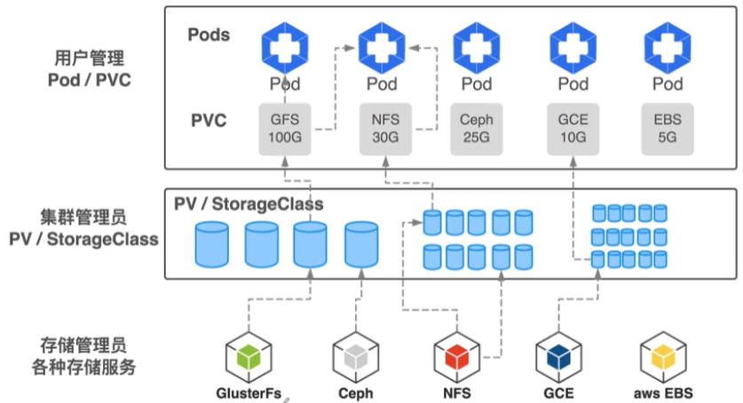

PV PVC必须建立绑定关系才能处于可用状态，pv要满足pvc的需求，如存储大小，读写权限，pvc和pv的storage class name 要一致

一个pod可以使用多个pvc，一个pvc可以同时为多个pod提供服务

一个pvc只能绑定一个pv，一个pv只能对应一种后端存储



三个glusterfs节点

每个节点上要有裸磁盘，没有分区的磁盘

安装glusterfs客户端，node1，node2

[root@node1 ~]#  yum install -y glusterfs glusterfs-fuse

apiserver,kubelet启动的参数需要携带  

```
[root@master ~]# ps -ef|grep apiserver|grep allow-privileged=true
root       2134   2100  3 05:02 ?        00:20:54 kube-apiserver --advertise-address=192.168.254.128 --allow-privileged=true --authorization-mode=Node,RBAC --client-ca-file=/etc/kubernetes/pki/ca.crt --enable-admission-plugins=NodeRestriction --enable-bootstrap-token-auth=true --etcd-cafile=/etc/kubernetes/pki/etcd/ca.crt --etcd-certfile=/etc/kubernetes/pki/apiserver-etcd-client.crt --etcd-keyfile=/etc/kubernetes/pki/apiserver-etcd-client.key --etcd-servers=https://127.0.0.1:2379 --insecure-port=0 --kubelet-client-certificate=/etc/kubernetes/pki/apiserver-kubelet-client.crt --kubelet-client-key=/etc/kubernetes/pki/apiserver-kubelet-client.key --kubelet-preferred-address-types=InternalIP,ExternalIP,Hostname --proxy-client-cert-file=/etc/kubernetes/pki/front-proxy-client.crt --proxy-client-key-file=/etc/kubernetes/pki/front-proxy-client.key --requestheader-allowed-names=front-proxy-client --requestheader-client-ca-file=/etc/kubernetes/pki/front-proxy-ca.crt --requestheader-extra-headers-prefix=X-Remote-Extra- --requestheader-group-headers=X-Remote-Group --requestheader-username-headers=X-Remote-User --secure-port=6443 --service-account-key-file=/etc/kubernetes/pki/sa.pub --service-cluster-ip-range=10.96.0.0/12 --tls-cert-file=/etc/kubernetes/pki/apiserver.crt --tls-private-key-file=/etc/kubernetes/pki/apiserver.key
[root@master ~]#
```


部署glusterfs服务

```
[root@master ~]# kubectl apply -f glusterfs-daemonset.yaml 
daemonset.apps/glusterfs created
[root@master ~]#
[root@master ~]# kubectl get pods -o wide
NAME                          READY   STATUS    RESTARTS   AGE     IP                NODE          NOMINATED NODE   READINESS GATES
dubbo-demo-5c6fc66f47-j9kmj   1/1     Running   3          7d21h   192.168.254.130   node2         <none>           <none>
glusterfs-l9tgb               1/1     Running   0          6m20s   192.168.254.132   glusterfs02   <none>           <none>
glusterfs-m76z6               1/1     Running   0          6m20s   192.168.254.131   glusterfs01   <none>           <none>
glusterfs-nmbjl               1/1     Running   0          6m20s   192.168.254.133   glusterfs03   <none>           <none>
[root@master ~]#
```

```
[root@master ~]# kubectl apply  -f heketi-deployment.yaml 
service/heketi created
configmap/tcp-services created
deployment.apps/heketi created
[root@master ~]# kubectl get pod -o wide
NAME                          READY   STATUS    RESTARTS   AGE     IP                NODE          NOMINATED NODE   READINESS GATES
dubbo-demo-5c6fc66f47-j9kmj   1/1     Running   3          7d23h   192.168.254.130   node2         <none>           <none>
glusterfs-l9tgb               1/1     Running   0          144m    192.168.254.132   glusterfs02   <none>           <none>
glusterfs-m76z6               1/1     Running   0          144m    192.168.254.131   glusterfs01   <none>           <none>
glusterfs-nmbjl               1/1     Running   0          144m    192.168.254.133   glusterfs03   <none>           <none>
heketi-d9556497-kp52z         0/1     Running   0          3s      10.244.3.8        glusterfs01   <none>           <none>
[root@master ~]#
```

初始化磁盘，进入运行的heketi容器

新版本的heketi在创建gfs集群时需要带上参数，声明用户名及密码，相应值在heketi.json文件中配置，即：

```
[root@heketi-d9556497-kp52z /]#export HEKETI_CLI_SERVER=http://localhost:8080
[root@heketi-d9556497-kp52z ~]# heketi-cli -s $HEKETI_CLI_SERVER --user admin --secret 'My Secret' topology load --json=topology.json
Creating cluster ... ID: 2ae97542b310276ee8084242f1e543df
	Allowing file volumes on cluster.
	Allowing block volumes on cluster.
	Creating node glusterfs01 ... ID: 731d27ac434f937a41184d661fc5ff84
		Adding device /dev/sdb ... OK
	Creating node glusterfs02 ... ID: ca8154a0f4b05cb4dfaeb6739fb53a9a
		Adding device /dev/sdb ... OK
	Creating node glusterfs03 ... ID: e227c462fa1be22e158dc70161a2faa5
		Adding device /dev/sdb ... OK
[root@heketi-d9556497-xmmx2 ~]#
```

执行了heketi-cli topology load之后，Heketi在服务器做的大致操作如下：

- 进入任意glusterfs Pod内，执行gluster peer status 发现都已把对端加入到了可信存储池(TSP)中。
- 在运行了gluster Pod的节点上，自动创建了一个VG，此VG正是由topology-sample.json 文件中的磁盘裸设备创建而来。
- 一块磁盘设备创建出一个VG，以后创建的PVC，即从此VG里划分的LV。
- heketi-cli topology info 查看拓扑结构，显示出每个磁盘设备的ID，对应VG的ID，总空间、已用空间、空余空间等信息。
  通过部分日志查看

查看信息

[root@heketi-d9556497-xmmx2 ~]# heketi-cli topology info -s $HEKETI_CLI_SERVER --user admin --secret 'My Secret'

进入glusterfs容器查看集群信息

```
[root@glusterfs01 ~]# docker ps|grep gluster
abd862209164        gluster/gluster-centos                               "/usr/local/bin/upda…"   2 hours ago         Up 2 hours                                                                 k8s_glusterfs_glusterfs-m76z6_default_bb08332e-7de2-4e0b-a624-0a6b7cdef77f_0
ec59e9080938        registry.aliyuncs.com/google_containers/pause:3.2    "/pause"                 2 hours ago         Up 2 hours                                                                 k8s_POD_glusterfs-m76z6_default_bb08332e-7de2-4e0b-a624-0a6b7cdef77f_0
[root@glusterfs01 ~]# docker exec -it abd862209164  bash
[root@glusterfs01 /]# gluster peer status
Number of Peers: 2

Hostname: 192.168.254.132
Uuid: 1efb1d0f-9518-4ff3-a233-ac94b1cf91f7
State: Peer in Cluster (Connected)

Hostname: 192.168.254.133
Uuid: 6428d24b-973e-4b50-b141-117c4fb43d80
State: Peer in Cluster (Connected)
[root@glusterfs01 /]# 
```

查看pv,pvc

```
[root@master ~]# kubectl get pvc
NAME            STATUS   VOLUME                                     CAPACITY   ACCESS MODES   STORAGECLASS              AGE
glusterfs-pvc   Bound    pvc-c8f63dd8-a552-4526-9ed5-acba84748532   1Gi        RWO            glusterfs-storage-class   18m
[root@master ~]# kubectl get pv
NAME                                       CAPACITY   ACCESS MODES   RECLAIM POLICY   STATUS   CLAIM                   STORAGECLASS              REASON   AGE
pvc-c8f63dd8-a552-4526-9ed5-acba84748532   1Gi        RWO            Delete           Bound    default/glusterfs-pvc   glusterfs-storage-class            18m
[root@master ~]#
```

pod使用pv

```
[root@master ~]# kubectl apply  -f web-deploy.yaml 
deployment.apps/web-deploy created
[root@master ~]# kubectl get pod -o wide 
NAME                          READY   STATUS    RESTARTS   AGE     IP                NODE          NOMINATED NODE   READINESS GATES
dubbo-demo-5c6fc66f47-j9kmj   1/1     Running   3          8d      192.168.254.130   node2         <none>           <none>
glusterfs-l9tgb               1/1     Running   0          3h12m   192.168.254.132   glusterfs02   <none>           <none>
glusterfs-m76z6               1/1     Running   0          3h12m   192.168.254.131   glusterfs01   <none>           <none>
glusterfs-nmbjl               1/1     Running   0          3h12m   192.168.254.133   glusterfs03   <none>           <none>
heketi-d9556497-kp52z         1/1     Running   0          48m     10.244.3.8        glusterfs01   <none>           <none>
web-deploy-f8f84d859-9h5jb    1/1     Running   0          6s      10.244.1.122      node1         <none>           <none>
web-deploy-f8f84d859-d2dc9    1/1     Running   0          6s      10.244.2.111      node2         <none>           <none>
```

进入node1的容器

```
[root@node1 ~]# docker exec -it 3ce7fe03df5c bash
OCI runtime exec failed: exec failed: container_linux.go:348: starting container process caused "exec: \"bash\": executable file not found in $PATH": unknown
[root@node1 ~]# docker exec -it 3ce7fe03df5c sh
/ # cd /weng-data/
/weng-data # ls
/weng-data # echo "hello" > aa
/weng-data # cat -n aa
     1	hello
/weng-data # 
```

进入node2的容器

```
[root@node2 ~]# docker exec -it 7569de5b5498 sh
/ # cat -n /weng-data/aa 
     1	hello
/ # echo "hi" > /weng-data/bb
/ # 
```

进入node1的容器

```
/weng-data # cat -n /weng-data/bb
     1	hi
/weng-data # 
```


