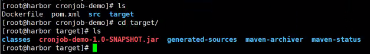
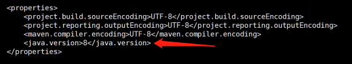
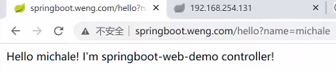
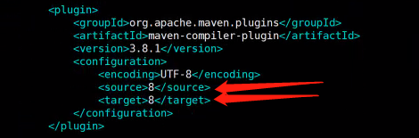
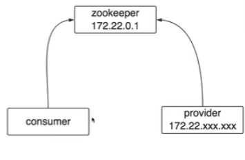
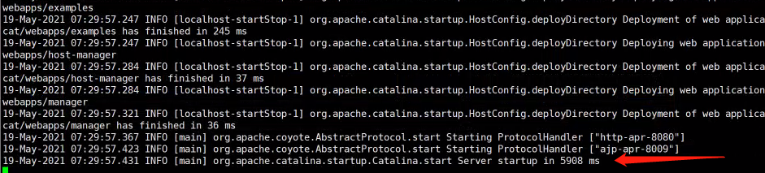

# 四种常见业务系统迁移至k8s

------

## 定时任务迁移kubernetes

项目结构如下，这是一个很简单的maven项目，没有任何外部依赖：


项目中只有一个`Main`类，代码如下：

```
package com.example.demo.cronjob;

import java.util.Random;

public class Main {

    public static void main(String[] args) {

        Random r = new Random();
        int time = r.nextInt(20) + 10;
        System.out.println("I will working for " + time + " seconds!");

        try {
            Thread.sleep(time * 1000);
        } catch (Exception e) {
            e.printStackTrace();
        }
        System.out.println("All work is done! Bye!");
    }
}
```

以往我们是将项目部署到Linux系统上，然后通过`crontab`定时执行这个项目。那么迁移到k8s后，该如何让k8s定时执行这个项目呢？这就是本小节将要介绍的内容。

将业务系统迁移到Kubernetes主要需要经过两大步： 

1、搞定基础镜像，Java项目自然需要运行在有JRE环境的容器里，所以直接上docker hub搜索下Java这个关键词使用官方的镜像即可。这里使用的是java8，所以我们直接拉取openjdk即可：

```
docker pull openjdk:8-jre-alpine
```

然后将镜像改下tag并推到我们自己的Harbor仓库上：

```
docker tag openjdk:8-jre-alpine 192.168.254.131/k8s/openjdk:8-jre-alpine
docker push 192.168.254.131/k8s/openjdk:8-jre-alpine
```

2、搞定服务运行的相关文件，项目中就只有一个类，进入到项目目录，直接通过maven进行打包即可：

```
cd /root/k8s-demo/cronjob-demo/
mvn clean package -Dmaven.test.skip=true
```

最终我们得到一个jar包：



3、构建镜像，创建一个Dockerfile，内容如下：

```
# vim Dockerfile
FROM 192.168.254.131/k8s/openjdk:8-jre-alpine

COPY target/cronjob-demo-1.0-SNAPSHOT.jar /cronjob-demo.jar

ENTRYPOINT ["java", "-cp", "cronjob-demo.jar", "com.example.demo.cronjob.Main"]
```

build 镜像：

```
docker build -t cronjob:v1 .
```

测试能否正常运行：

```
#docker run -it cronjob:v1
I will working for 12 seconds!
All work is done! Bye!
# 
```

把该镜像推到我们自己的Harbor仓库上：

```
# docker tag cronjob:v1 192.168.254.131/k8s/cronjob:v1
# docker push 192.168.254.131/k8s/cronjob:v1
```

4、确定服务发现的策略，由于这只是一个定时任务，不需要服务发现，所以这一步略过

5、编写cronjob.yaml文件，`这里harbor仓库设置为公有的，私有的拉取镜像会提示没权限，需要另外配置`

```
apiVersion: batch/v1beta1
kind: CronJob
metadata:
  name: cronjob-demo
spec:
  # 定义cron表达式，与linux里的表达式是一样的
  schedule: "*/1 * * * *"
  # 保留执行成功的3个历史job
  successfulJobsHistoryLimit: 3
  # 是否挂起，如果设置为true则任务不会真正被执行
  suspend: false
  # 并行的策略
  concurrencyPolicy: Forbid
  # 保留执行失败的1个历史job
  failedJobsHistoryLimit: 1
  jobTemplate:
    spec:
      template:
        metadata:
          labels:
            app: cronjob-demo
        spec:
          # 重启策略
          restartPolicy: Never
          containers:
          - name: cronjob-demo
            image: 192.168.254.131/k8s/cronjob:v1
```

因为定时任务的特殊性，可能上一个Job没执行完，新的就产生了，可以通过spec.concurrencyPolicy字段来定义处理策略

- concurrencyPolicy=Allow，默认情况，Job可以同时存在
- concurrencyPolicy=Forbid，不会创建新的Pod，该创建周期被跳过
- concurrencyPolicy=Replace，新生产的Job会替换旧的没有执行完的Job

将`cronjob`部署到k8s上：

```
# kubectl apply -f cronjob.yaml 
cronjob.batch/cronjob-demo created
# 
```

部署完成后，查看运行情况：

```
# kubectl get cronjobs
NAME           SCHEDULE      SUSPEND   ACTIVE   LAST SCHEDULE   AGE
cronjob-demo   */1 * * * *   False     0        <none>          29s
# kubectl get cronjobs
NAME           SCHEDULE      SUSPEND   ACTIVE   LAST SCHEDULE   AGE
cronjob-demo   */1 * * * *   False     1        12s             43s
# kubectl get pods
NAME                            READY   STATUS      RESTARTS   AGE
cronjob-demo-1599535980-brd88   0/1     Completed   0          37s
# kubectl logs cronjob-demo-1599535980-brd88
I will working for 15 seconds!
All work is done! Bye!
# 
```

------

## SpringBoot的web服务迁移kubernetes

项目结构如下：


这是一个最基础的SpringBoot web服务，启动类和maven依赖没啥好说的，controller的内容如下：

```
package com.example.demo.controller;

import org.springframework.web.bind.annotation.RequestMapping;
import org.springframework.web.bind.annotation.RequestParam;
import org.springframework.web.bind.annotation.RestController;

@RestController
public class DemoController {

    @RequestMapping("/hello")
    public String sayHello(@RequestParam String name) {
        return "Hello " + name + "! I'm springboot-web-demo controller!";
    }
}
```

配置文件的内容如下：

```
server.name=springboot-web-demo
server.port=8080
```

按照之前的步骤，进入项目所在目录，把pom.xml文件的java version改为8，开始打包：



```
#mvn clean package -Dmaven.test.skip=true
# tree
.
├── classes
│   ├── applications.properties
│   └── com
│       └── example
│           └── demo
│               ├── controller
│               │   └── DemoController.class
│               └── ServiceApplication.class
├── generated-sources
│   └── annotations
├── maven-archiver
│   └── pom.properties
├── maven-status
│   └── maven-compiler-plugin
│       └── compile
│           └── default-compile
│               ├── createdFiles.lst
│               └── inputFiles.lst
├── springboot-web-demo-1.0-SNAPSHOT.jar
└── springboot-web-demo-1.0-SNAPSHOT.jar.original
```

测试能否正常运行：

```
[root@harbor target]# java -jar springboot-web-demo-1.0-SNAPSHOT.jar
```


可以正常访问

编写Dockerfile：

```
[root@harbor spring-boot-web]# vim Dockerfile
FROM 192.168.254.131/k8s/openjdk:8-jre-alpine

COPY target/springboot-web-demo-1.0-SNAPSHOT.jar /springboot-web-demo.jar

ENTRYPOINT ["java", "-jar", "springboot-web-demo.jar"]
```

build 镜像：

```
[root@harbor springboot-web-demo]# docker build -t springboot-web:v1 .
Sending build context to Docker daemon  16.26MB
Step 1/3 : FROM 192.168.254.131/k8s/openjdk:8-jre-alpine
 ---> f7a292bbb70c
Step 2/3 : COPY target/springboot-web-demo-1.0-SNAPSHOT.jar /springboot-web-demo.jar
 ---> 35c07f5e5ee9
Step 3/3 : ENTRYPOINT ["java", "-jar", "springboot-web-demo.jar"]
 ---> Running in 33aef030fc36
Removing intermediate container 33aef030fc36
 ---> 8c03b4902c52
Successfully built 8c03b4902c52
Successfully tagged springboot-web:v1
```

把该镜像推到我们自己的Harbor仓库上：

```
[root@harbor springboot-web-demo]# docker tag springboot-web:v1  192.168.254.131/k8s/springboot-web:v1
[root@harbor springboot-web-demo]# docker push 192.168.254.131/k8s/springboot-web:v1
```

由于这是一个需要提供给外部访问的`web`服务，所以我们需要确定服务发现的策略，这里采用的就是之前我们搭建的`ingress-nginx`。编写springboot-web.yaml 文件：

```
#deploy
apiVersion: apps/v1
kind: Deployment
metadata:
  name: springboot-web-demo
spec:
  selector:
    matchLabels:
      app: springboot-web-demo
  replicas: 1
  template:
    metadata:
      labels:
        app: springboot-web-demo
    spec:
      containers:
      - name: springboot-web-demo
        image: 192.168.254.131/k8s/springboot-web:v1
        ports:
        - containerPort: 8080
---
#service
apiVersion: v1
kind: Service
metadata:
  name: springboot-web-demo
spec:
  ports:
  - port: 80
    protocol: TCP
    targetPort: 8080
  selector:
    app: springboot-web-demo
  type: ClusterIP

---
#ingress
apiVersion: extensions/v1beta1
kind: Ingress
metadata:
  name: springboot-web-demo
spec:
  rules:
  - host: springboot.weng.com
    http:
      paths:
      - path: /
        backend:
          serviceName: springboot-web-demo                                       
          servicePort: 80
```

将`springboot-web-demo`部署到k8s上：

```
[root@m1 ~/spring-boot-web]# kubectl apply -f springboot-web.yaml 
```

查看运行状态：

```
[root@master ~]# kubectl get pods,svc,deploy
NAME                                      READY   STATUS    RESTARTS   AGE
pod/springboot-web-demo-66f89d498-glq2j   1/1     Running   0          4m46s

NAME                          TYPE        CLUSTER-IP     EXTERNAL-IP   PORT(S)   AGE
service/kubernetes            ClusterIP   10.96.0.1      <none>        443/TCP   26h
service/springboot-web-demo   ClusterIP   10.100.68.15   <none>        80/TCP    4m46s

NAME                                  READY   UP-TO-DATE   AVAILABLE   AGE
deployment.apps/springboot-web-demo   1/1     1            1           4m46s
```

为了使得访问`springboot.weng.com`域名能够请求到部署了`ingress-nginx`服务的`worker`节点上，需要在本机的`hosts`文件中添加一行配置，这里的ip为部署了`ingress-nginx`节点的ip：

```
192.168.254.129 springboot.weng.com
```

外部访问测试：




------

## 传统dubbo服务迁移kubernetes

项目结构如下：


首先看`dubbo-demo-api`项目，里面定义的是需要给外部调用的服务api，其表现形式就是一个Java接口。代码如下：

```
package com.example.demo.api;

public interface DemoService {

    String sayHello(String name);
}
```

然后再看`dubbo-demo`项目，这是服务提供者（provider）的具体实现，实现了api项目里定义的接口。代码如下：

```
package com.example.demo.service;

import com.example.demo.api.DemoService;
import org.slf4j.Logger;
import org.slf4j.LoggerFactory;

public class DemoServiceImpl implements DemoService {

    private static final Logger log = LoggerFactory.getLogger(DemoServiceImpl.class);

    @Override
    public String sayHello(String name) {
        log.debug("dubbo say hello to : {}", name);
        return "Hello " + name;
    }
}
```

`provider.xml`文件里则定义了服务提供者的信息，如service的api及其实现类路径等：

```
<beans xmlns:xsi="http://www.w3.org/2001/XMLSchema-instance"
       xmlns:dubbo="http://dubbo.apache.org/schema/dubbo"
       xmlns="http://www.springframework.org/schema/beans"
       xsi:schemaLocation="http://www.springframework.org/schema/beans http://www.springframework.org/schema/beans/spring-beans-4.3.xsd
       http://dubbo.apache.org/schema/dubbo http://dubbo.apache.org/schema/dubbo/dubbo.xsd">

    <!-- service implementation, as same as regular local bean -->
    <bean id="demoService" class="com.example.demo.service.DemoServiceImpl"/>

    <!-- declare the service interface to be exported -->
    <dubbo:service interface="com.example.demo.api.DemoService" ref="demoService"/>

</beans>
```

docker运行zookeeper，把下面`dubbo.properties`参数的ip改为自己启动的即可

```
docker run --name zk01 -p 2181:2181 --restart always -d zookeeper
```

`dubbo.properties`文件则定义了dubbo相关的一些配置信息：

```
# 服务名称
dubbo.application.name=demo
# zookeeper的注册地址
dubbo.registry.address=zookeeper://192.168.254.131:2181
# provider.xml文件的路径
dubbo.spring.config=classpath*:spring/provider.xml
# 协议名称
dubbo.protocol.name=dubbo
# 服务对外暴露的端口
dubbo.protocol.port=20880
```

了解完项目的基本内容后，我们将其打包一下，这与之前有点不一样。首先进入`dubbo-demo-api`项目，将其安装到本地仓库，因为`dubbo-demo`项目的pom文件依赖了它：

```
# mvn clean install -Dmaven.test.skip=true
```

然后进入`dubbo-demo`项目进行打包，把pom.xml文件的java version改为8,：



```
# mvn clean package -Dmaven.test.skip=true
```

打包成功会有一个压缩包和一个jar包：

```
[root@harbor dubbo-demo]# ls target/
archive-tmp  bin  classes  conf  dubbo-demo-1.0-SNAPSHOT-assembly.tar.gz  dubbo-demo-1.0-SNAPSHOT.jar  generated-sources  maven-archiver  maven-status
```

将压缩包解压：

```
[root@harbor target]# tar xvf dubbo-demo-1.0-SNAPSHOT-assembly.tar.gz
```

执行启动脚本启动该项目：

```
[root@harbor bin]# sh start.sh 
Starting the demo ...PID: 22396
```

查看日志输出：

```
[root@harbor logs]# cat stdout.log 
[2021-05-18 16:25:52] Dubbo service server started!
```

查看端口是否有正常监听：

```
[root@harbor logs]# netstat -lntp |grep 20880
tcp        0      0 0.0.0.0:20880           0.0.0.0:*               LISTEN      29047/java  
```

使用`telnet`测试服务调用是否正常：

```
[root@harbor logs]# telnet 192.168.254.131 20880
Trying 192.168.254.131...
Connected to 192.168.254.131.
Escape character is '^]'.

dubbo>
dubbo>ls
com.example.demo.api.DemoService
dubbo>ls com.example.demo.api.DemoService
sayHello
dubbo>invoke com.example.demo.api.DemoService.sayHello("weng")            
"Hello weng"
elapsed: 7 ms.
dubbo>
```

测试`stop.sh`脚本能否正常停止项目：

```
[root@harbor bin]# sh stop.sh 
Stopping the demo ....OK!
PID: 29047
[root@harbor bin]# 
```

测试完后，将压缩包里的内容解压到一个单独的目录下，要放到docker里的文件：

```
[root@harbor target]# pwd
/root/k8s-demo/dubbo-demo/target
[root@harbor target]# mkdir ROOT
[root@harbor target]# tar xfv dubbo-demo-1.0-SNAPSHOT-assembly.tar.gz -C ROOT/
[root@harbor target]# ls ROOT/
bin  conf  lib
[root@harbor target]#
```

由于容器内部环境与操作系统环境是不一样的，所以我们需要修改`start.sh`启动脚本让它前台运行，修改后的内容如下：

```
nohup ${JAVA_HOME}/bin/java -Dapp.name=${SERVER_NAME} ${JAVA_OPTS} ${JAVA_DEBUG_OPTS} ${JAVA_JMX_OPTS} -classpath ${CONF_DIR}:${LIB_JARS} com.alibaba.dubbo.container.Main >> ${STDOUT_FILE} 2>&1 &
修改为
${JAVA_HOME}/bin/java -Dapp.name=${SERVER_NAME} ${JAVA_OPTS} ${JAVA_DEBUG_OPTS} ${JAVA_JMX_OPTS} -classpath ${CONF_DIR}:${LIB_JARS} com.alibaba.dubbo.container.Main >> ${STDOUT_FILE} 2>&1

删除以下配置
PIDS=`ps  --no-heading -C java -f --width 1000 | grep "${CONF_DIR}" |awk '{print $2}'`
if [ -n "${PIDS}" ]; then
    echo "ERROR: The ${SERVER_NAME} already started!"
    echo "PID: ${PIDS}"
    exit 1
fi
```

然后编写Dockerfile：

```
[root@harbor dubbo-demo]# cat Dockerfile 
FROM 192.168.254.131/k8s/openjdk:8-jre-alpine 

COPY target/ROOT /ROOT

ENTRYPOINT ["sh", "/ROOT/bin/start.sh"]
```

build 镜像：

```
[root@harbor dubbo-demo]# docker build -t dubbo:v1 .
```

测试能否正常运行：

```
[root@harbor dubbo-demo]# docker run -it dubbo:v1
Starting the demo ...
```

把该镜像推到我们自己的Harbor仓库上：

```
[root@harbor dubbo-demo]# docker tag  dubbo:v1 192.168.254.131/k8s/dubbo:v1
[root@harbor dubbo-demo]# docker push 192.168.254.131/k8s/dubbo:v1
```

确定服务发现的策略，这里使用第二种

1、provider运行在容器里，有容器的ip，会注册到zookeeper，集群内的服务可以访问得到这个pod的ip，集群外的不可以。解决，容器启动的时候加一个环境变量指定宿主机所在的真实ip，把当前宿主机的ip写在一个文件里,/usr/env/{192.168.254.13x},把这个文件挂在到容器里面，通过文件可以渠道宿主机ip;



2、使用`hostNetwork`模式，宿主机的ip会注册到zookeeper，不存在上面的问题。20880端口监听在这台主机上，如果其他dubbo服务也调度到了这台主机上，端口也是一样的话，就会发生端口冲突的问题。所以选择`hostNetwork`模式就必须保证每个dubbo服务的端口都不一样，由于要确保每个服务的端口都不一样，就得考虑有一个统一的地方管理好这些服务的端口。配置一个环境变量，dubbo-port:20881，服务启动的时候端口变成20881，写脚本。

在start.sh的加上以下配置

```
if [ ! -z "${DUBBO_PORT}"];then
    sed -i "s/dubbo.protocol.port=${SERVER_PORT}/dubbo.protocol.port=${DUBBO_PORT}/g" conf/dubbo.properties
    SERVER_PORT=${DUBBO_PORT}
fi
```

编写dubbo.yaml配置文件：

```
#deploy
apiVersion: apps/v1
kind: Deployment
metadata:
  name: dubbo-demo
spec:
  selector:
    matchLabels:
      app: dubbo-demo
  replicas: 1
  template:
    metadata:
      labels:
        app: dubbo-demo
    spec:
      hostNetwork: true
      affinity:
        podAntiAffinity:
          # 让dubbo在多个实例情况下不调度在同一个节点上，避免端口冲突
          requiredDuringSchedulingIgnoredDuringExecution:
          - labelSelector:
              matchExpressions:
              - key: app
                operator: In
                values:
                - dubbo-demo
            topologyKey: "kubernetes.io/hostname"
      containers:
      - name: dubbo-demo
        image: 192.168.254.131/k8s/dubbo:v1
        ports:
        - containerPort: 20881
        env:
        - name: DUBBO_PORT
          value: "20881"    
```

将`dubbo-demo`部署到k8s上：

```
[root@m1 ~/dubbo-demo]# kubectl apply -f dubbo-demo.yaml 
```

查看运行状态：

```
[root@master ~]# kubectl apply -f dubbo.yaml 
deployment.apps/dubbo-demo created
[root@master ~]# kubectl get pods -o wide
NAME                                  READY   STATUS    RESTARTS   AGE     IP                NODE    NOMINATED NODE   READINESS GATES
dubbo-demo-644c64568d-fc8hs           1/1     Running   0          3s      192.168.254.130   node2   <none>           <none>
springboot-web-demo-66f89d498-glq2j   1/1     Running   0          7h47m   10.244.2.25       node2   <none>           <none>
```

可以看到该Pod被调度到了node2节点上，到node2节点上看看端口是否有正常监听：

```
[root@node2 ~]# netstat -tnlp|grep 20881
tcp        0      0 0.0.0.0:20881           0.0.0.0:*               LISTEN      98231/java
```

使用`telnet`测试服务调用是否正常：

```
[root@harbor dubbo-demo]# telnet 192.168.254.130 20881
Trying 192.168.254.130...
Connected to 192.168.254.130.
Escape character is '^]'.
ls
com.example.demo.api.DemoService
dubbo>ls com.example.demo.api.DemoService
sayHello
dubbo>invoke com.example.demo.api.DemoService.sayHello("aa")
"Hello aa"
elapsed: 4 ms.
dubbo>exit
```

------

## 传统web服务迁移kubernetes

项目结构如下：


这是一个典型的传统web项目，配置文件都是标准的没啥好说的。其中controller的代码如下，调用了之前我们部署的dubbo服务：

```
package com.example.demo.controller;

import com.example.demo.api.DemoService;
import org.slf4j.Logger;
import org.slf4j.LoggerFactory;
import org.springframework.beans.factory.annotation.Autowired;
import org.springframework.stereotype.Controller;
import org.springframework.web.bind.annotation.RequestMapping;
import org.springframework.web.bind.annotation.RequestParam;
import org.springframework.web.bind.annotation.ResponseBody;

@Controller
public class DemoController {

    private static final Logger log = LoggerFactory.getLogger(DemoController.class);

    @Autowired
    private DemoService demoService;

    @RequestMapping("/hello")
    @ResponseBody
    public String sayHello(@RequestParam String name) {
        log.debug("say hello to :{}", name);
        String message = demoService.sayHello(name);
        log.debug("dubbo result:{}", message);

        return message;
    }
}
```

由于传统的web服务是需要运行在Tomcat之类的web容器里的，所以就不能像之前那样只单纯使用一个Java镜像了。先准备好基础镜像并推到Harbor上：

```
[root@node2 ~]# docker pull registry.cn-hangzhou.aliyuncs.com/liuyi01/tomcat:8.0.51-alpine
[root@node2 ~]# docker tag registry.cn-hangzhou.aliyuncs.com/liuyi01/tomcat:8.0.51-alpine 192.168.254.131/k8s/tomcat:8.0.51-alpine 
[root@node2 ~]# docker push 192.168.254.131/k8s/tomcat:8.0.51-alpine
```

然后通过maven对项目进行打包，这里要修改web-demo目录的pom.xml文件的<plugins>添加以下配置，因为使用的tomcat镜像依赖的是java1.7版本的：

```
         <plugins>
            <plugin>
                <groupId>org.apache.maven.plugins</groupId>
                <artifactId>maven-compiler-plugin</artifactId>
                <version>3.7.0</version>
                <configuration>
                    <source>7</source>
                    <target>7</target>
                </configuration>
            </plugin>
         <plugins>
```

```
[root@harbor web-demo]#  mvn clean package -Dmaven.test.skip=true
```

修改zookeeper的地址，

```
vim src/main/resources/applicationContext-service-config.xml
<dubbo:registry address="zookeeper://192.168.254.131:2181" />
```

打出来的是一个war包：

```
[root@harbor web-demo]# cd target/
[root@harbor target]# ls
classes  generated-sources  maven-archiver  maven-status  web-demo-1.0-SNAPSHOT  web-demo-1.0-SNAPSHOT.war
[root@harbor target]# mkdir ROOT
[root@harbor target]# mv web-demo-1.0-SNAPSHOT.war ROOT/
[root@harbor target]# cd ROOT/
[root@harbor ROOT]# ls
web-demo-1.0-SNAPSHOT.war
```

创建一个`ROOT`目录并将`war`包解压到该目录中：

```
[root@harbor ROOT]# jar -xvf web-demo-1.0-SNAPSHOT.war
[root@harbor ROOT]# rm -f web-demo-1.0-SNAPSHOT.war 
```

由于Tomcat自带的启动脚本是后台启动的，会导致容器启动后就退出，所以我们需要自定义一个启动脚本让容器前台运行，这样才不会退出：

```
[root@harbor web-demo]# vim start.sh
sh /usr/local/tomcat/bin/startup.sh
# 为了让容器不会退出
tail -f /usr/local/tomcat/logs/catalina.out
[root@harbor web-demo]# chmod +x start.sh
```

编写Dockerfile：

```
[root@harbor web-demo]# vim Dockerfile
FROM 192.168.254.131/k8s/tomcat:8.0.51-alpine

# 拷贝到Tomcat的部署目录下
COPY target/ROOT /usr/local/tomcat/webapps/ROOT
# 拷贝自定义启动脚本
COPY start.sh /usr/local/tomcat/bin/start.sh

ENTRYPOINT ["sh", "/usr/local/tomcat/bin/start.sh"]
```

build 镜像：

```
[root@harbor web-demo]# docker build -t web-demo:v1 .
```

测试能否正常运行，启动成功：

```
[root@harbor web-demo]# docker run -it web:v1
```



把该镜像推到我们自己的Harbor仓库上：

```
[root@harbor web-demo]# docker tag web:v1 192.168.254.131/k8s/web:v1
[root@harbor web-demo]# docker push  192.168.254.131/k8s/web:v1
```

服务发现策略与之前演示的那个Spring Boot Web服务的策略是一样的，通过ingress-nginx暴露给外部访问。编写k8s配置文件：

```
#deploy
apiVersion: apps/v1
kind: Deployment
metadata:
  name: web-demo
spec:
  selector:
    matchLabels:
      app: web-demo
  replicas: 1
  template:
    metadata:
      labels:
        app: web-demo
    spec:
      containers:
      - name: web-demo
        image: 192.168.254.131/k8s/web:v1
        ports:
        - containerPort: 8080
---
#service
apiVersion: v1
kind: Service
metadata:
  name: web-demo
spec:
  ports:
  - port: 80
    protocol: TCP
    targetPort: 8080
  selector:
    app: web-demo
  type: ClusterIP

---
#ingress
apiVersion: extensions/v1beta1
kind: Ingress
metadata:
  name: web-demo
spec:
  rules:
    - host: web.weng.com
      http:
        paths:
          - path: /
            backend:
              serviceName: web-demo
              servicePort: 80
```

将`web-demo`部署到k8s集群中：

```
[root@master ~]# kubectl apply -f web.yaml 
```

查看服务运行状态：

```
[root@master ~]# kubectl get pods -o wide
NAME                                  READY   STATUS    RESTARTS   AGE    IP                NODE    NOMINATED NODE   READINESS GATES
dubbo-demo-644c64568d-fc8hs           1/1     Running   1          16h    192.168.254.130   node2   <none>           <none>
springboot-web-demo-66f89d498-glq2j   1/1     Running   1          24h    10.244.2.26       node2   <none>           <none>
web-demo-77b66c9d7d-mdzvn             1/1     Running   0          3m3s   10.244.1.46       node1   <none>           <none>
[root@master ~]# kubectl get svc
NAME                  TYPE        CLUSTER-IP      EXTERNAL-IP   PORT(S)   AGE
kubernetes            ClusterIP   10.96.0.1       <none>        443/TCP   2d3h
springboot-web-demo   ClusterIP   10.100.68.15    <none>        80/TCP    24h
web-demo              ClusterIP   10.104.164.97   <none>        80/TCP    3m8s
[root@master ~]#
```

为了使得访问`web.weng.com`域名能够请求到部署了`ingress-nginx`服务的`worker`节点上，需要在本机的`hosts`文件中添加一行配置，这里的ip为部署了`ingress-nginx`节点的ip：

```
192.168.254.129 web.weng.com
```

外部访问测试： 

